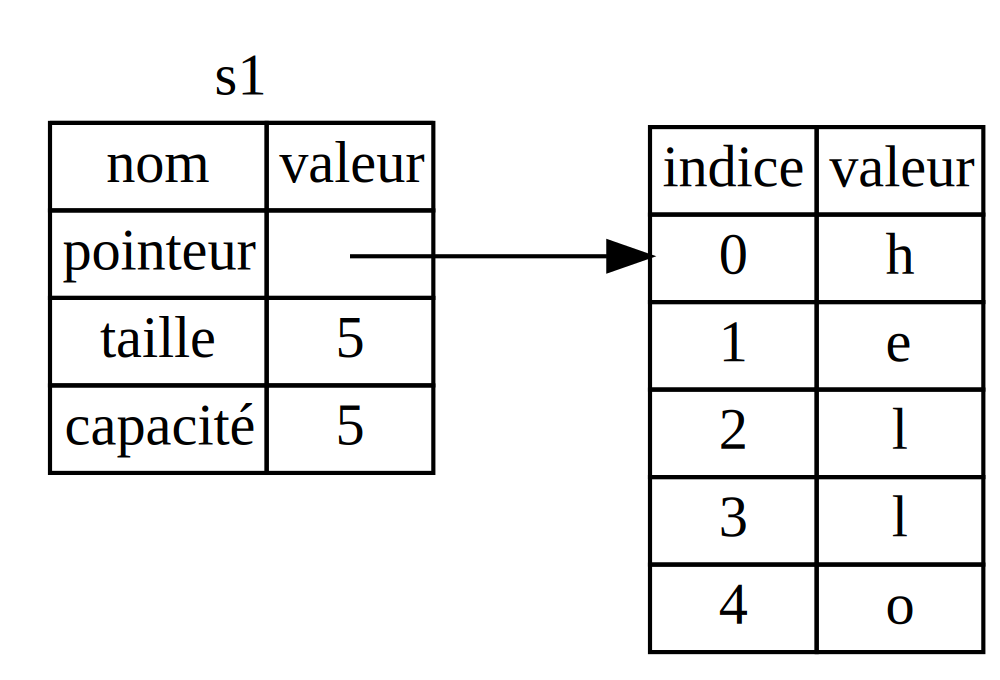
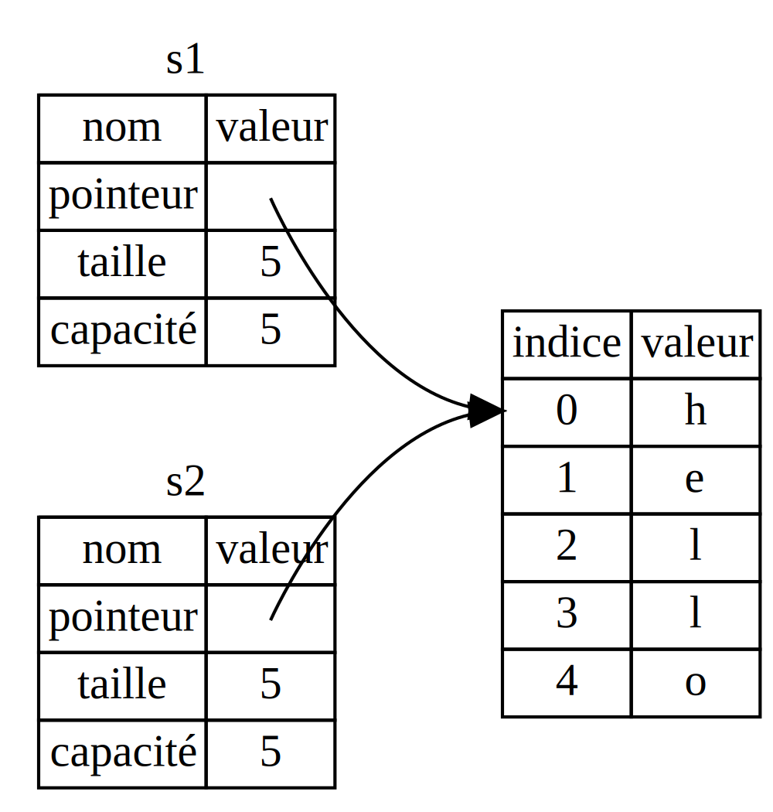
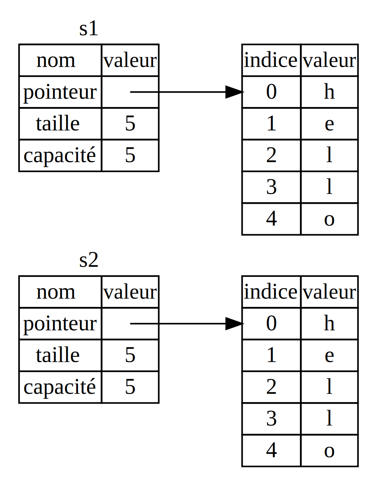
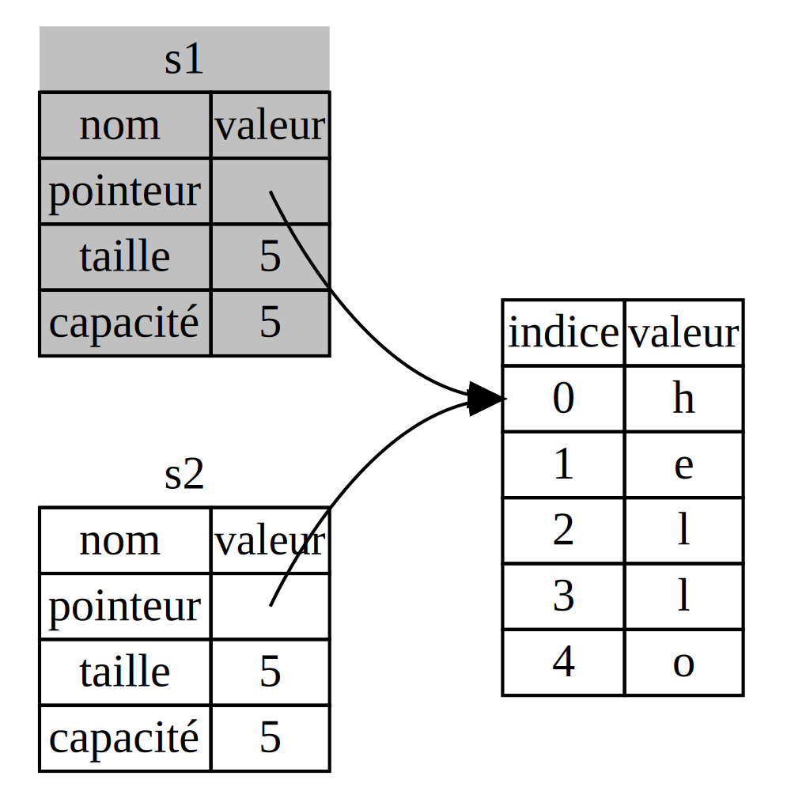

<!--
## What Is Ownership?
-->

## Qu'est-ce que la possession ?

<!--
Rust’s central feature is *ownership*. Although the feature is straightforward
to explain, it has deep implications for the rest of the language.
-->

La principale spécificité de Rust est *la possession*. Bien que cette
fonctionnalité soit simple à expliquer, elle a de profondes conséquences sur le
reste du langage.

<!--
All programs have to manage the way they use a computer’s memory while running.
Some languages have garbage collection that constantly looks for no longer used
memory as the program runs; in other languages, the programmer must explicitly
allocate and free the memory. Rust uses a third approach: memory is managed
through a system of ownership with a set of rules that the compiler checks at
compile time. None of the ownership features slow down your program while it’s
running.
-->

Tous les programmes doivent gérer la façon dont ils utilisent la mémoire
lorsqu'ils s'exécutent. Certains langages ont un ramasse-miettes qui scrute
constamment la mémoire qui n'est plus utilisée pendant qu'il s'exécute; dans
d'autres langages, le développeur doit explicitement allouer et libérer la
mémoire. Rust adopte une troisième approche : la mémoire est gérée avec un
système de possession qui repose sur un jeu de règles que le compilateur vérifie
au moment de la compilation. Il n'y a pas d'impact sur les performances pendant
l'exécution pour toutes les fonctionnalités de possession.

<!--
Because ownership is a new concept for many programmers, it does take some time
to get used to. The good news is that the more experienced you become with Rust
and the rules of the ownership system, the more you’ll be able to naturally
develop code that is safe and efficient. Keep at it!
-->

Comme la possession est un nouveau principe pour de nombreux développeurs,
cela prend un certain temps pour s'y familiariser. La bonne nouvelle est que
plus vous devenez expérimenté avec Rust et ses règles de possession, plus vous
développerez naturellement du code sûr et efficace. Gardez bien cela à
l'esprit !

<!--
When you understand ownership, you’ll have a solid foundation for understanding
the features that make Rust unique. In this chapter, you’ll learn ownership by
working through some examples that focus on a very common data structure:
strings.
-->

Lorsque vous comprendrez la possession, vous aurez des base solide pour
comprendre les fonctionnalités qui font la particularité de Rust. Dans ce
chapitre, vous allez apprendre la possession en pratiquant avec plusieurs
exemples qui se concentrent sur une structure de données très courante : les
chaînes de caractères.

<!--
> ### The Stack and the Heap
>
> In many programming languages, you don’t have to think about the stack and
> the heap very often. But in a systems programming language like Rust, whether
> a value is on the stack or the heap has more of an effect on how the language
> behaves and why you have to make certain decisions. Parts of ownership will
> be described in relation to the stack and the heap later in this chapter, so
> here is a brief explanation in preparation.
>
> Both the stack and the heap are parts of memory that are available to your code
> to use at runtime, but they are structured in different ways. The stack stores
> values in the order it gets them and removes the values in the opposite order.
> This is referred to as *last in, first out*. Think of a stack of plates: when
> you add more plates, you put them on top of the pile, and when you need a
> plate, you take one off the top. Adding or removing plates from the middle or
> bottom wouldn’t work as well! Adding data is called *pushing onto the stack*,
> and removing data is called *popping off the stack*.
>
> All data stored on the stack must have a known, fixed size. Data with an
> unknown size at compile time or a size that might change must be stored on
> the heap instead. The heap is less organized: when you put data on the heap,
> you request a certain amount of space. The operating system finds an empty
> spot in the heap that is big enough, marks it as being in use, and returns a
> *pointer*, which is the address of that location. This process is called
> *allocating on the heap* and is sometimes abbreviated as just *allocating*.
> Pushing values onto the stack is not considered allocating. Because the
> pointer is a known, fixed size, you can store the pointer on the stack, but
> when you want the actual data, you must follow the pointer.
>
> Think of being seated at a restaurant. When you enter, you state the number of
> people in your group, and the staff finds an empty table that fits everyone
> and leads you there. If someone in your group comes late, they can ask where
> you’ve been seated to find you.
>
> Pushing to the stack is faster than allocating on the heap because the
> operating system never has to search for a place to store new data; that
> location is always at the top of the stack. Comparatively, allocating space
> on the heap requires more work, because the operating system must first find
> a big enough space to hold the data and then perform bookkeeping to prepare
> for the next allocation.
>
> Accessing data in the heap is slower than accessing data on the stack because
> you have to follow a pointer to get there. Contemporary processors are faster
> if they jump around less in memory. Continuing the analogy, consider a server
> at a restaurant taking orders from many tables. It’s most efficient to get
> all the orders at one table before moving on to the next table. Taking an
> order from table A, then an order from table B, then one from A again, and
> then one from B again would be a much slower process. By the same token, a
> processor can do its job better if it works on data that’s close to other
> data (as it is on the stack) rather than farther away (as it can be on the
> heap). Allocating a large amount of space on the heap can also take time.
>
> When your code calls a function, the values passed into the function
> (including, potentially, pointers to data on the heap) and the function’s
> local variables get pushed onto the stack. When the function is over, those
> values get popped off the stack.
>
> Keeping track of what parts of code are using what data on the heap,
> minimizing the amount of duplicate data on the heap, and cleaning up unused
> data on the heap so you don’t run out of space are all problems that ownership
> addresses. Once you understand ownership, you won’t need to think about the
> stack and the heap very often, but knowing that managing heap data is why
> ownership exists can help explain why it works the way it does.
-->

> ### La pile et le tas
>
> Dans de nombreux langages, il n'est pas nécessaire de se préoccupper de la
> pile et du tas. Mais dans un système de langage de programmation comme
> Rust, si une donnée est sur la pile ou sur le tas influe le comportement du
> langage et explique pourquoi nous devons faire certains choix. Nous décrirons
> plus loin dans ce chapitre les différences entre la pile et le tas, voici
> donc une brève explication en attendant.
>
> La pile et le tas sont tous les deux des emplacements de la mémoire qui
> sont à disposition de votre code lors de son exécution, mais sont organisés de
> façon différents. La pile enregistre les valeurs dans l'ordre qu'elle le
> reçoit et enlève les valeurs dans l'autre sens. C'est ce que l'on appelle le
> principe de *dernier entré, premier sorti*. C'est comme une pile d'assiettes :
> quand vous ajoutez des nouvelles assiettes, vous les déposez sur le dessus de
> la pile, et quand vous avez besoin d'une assiette, vous en prenez une sur le
> dessus. Ajouter ou enlever des assiettes au milieu ou en bas ne serait pas
> aussi efficace ! Ajouter une donnée est ainsi appelé *déposer sur la pile* et
> en enlever une se dit *retirer de la pile*.
>
> Toutes les données stockées dans la pile doivent avoir une taille connue et
> fixe. Les données avec une taille inconnue au moment de la compilation ou une
> taille qui peut changer doivent plutôt être stockées sur le tas. Le tas est
> moins bien organisé : lorsque vous ajoutez des données sur le tas, vous
> demandez une certaine quantité d'espace mémoire. Le système d'exploitation va
> trouver un emplacement dans le tas qui est suffisamment grand, va le marquer
> comme étant en cours d'utilisation, et va retourner un *pointeur*, qui est
> l'adresse de cet emplacement. Cette procédure est appelée *affecter de la
> place sur le tas*, et parfois nous raccourcissons cette phrase à simplement
> *affectation*. Pousser des valeurs sur la pile n'est pas considéré comme
> une affectation. Comme le pointeur a une taille connue et fixe, nous pouvons
> stocker ce pointeur sur la pile, mais quand nous voulons la donnée souhaitée,
> nous avons devons suivre le pointeur.
>
> C'est comme si vous vouliez manger à un restaurant. Quand vous entrez, vous
> indiquez le nombre de personnes dans votre groupe, et le personnel trouve une
> table vide qui peut recevoir tout le monde, et vous y conduit. Si quelqu'un
> dans votre groupe arrive en retard, il peut leur demander où vous êtes assis
> pour vous rejoindre.
>
> Déposer sur la pile est plus rapide qu'affecter sur le tas car le système
> d'exploitation ne va jamais avoir besoin de chercher un emplacement pour y
> stocker les nouvelles données; car c'est toujours au-dessus de la pile. En
> comparaison, allouer de la place sur le tas demande plus de travail, car le
> système d'exploitation doit d'abord trouver un espace assez grand pour stocker
> les données et mettre à jour son suivi pour préparer la prochaine affectation.
> 
> Accéder à des données dans le tas est plus lent que d'accéder aux données sur
> la pile car nous devons suivre un pointeur pour l'obtenir. Les processeurs
> modernes sont plus rapides s'ils se déplacent moins dans la mémoire. Pour
> continuer avec notre analogie, imaginez une serveur dans un restaurant qui
> prend les commandes de nombreuses tables. C'est plus efficace de récupérer
> toutes les commandes à une seule table avant de passer à la table suivante.
> Prendre une commande à la table A, puis prendre une commande à la table B,
> puis ensuite une autre à la table A, puis une autre à la table B serait un
> processus bien plus lent. De la même manière, un processeur sera plus efficace
> dans sa tâche s'il travaille sur des données qui sont proches l'une de l'autre
> (comme c'est le cas sur la pile) plutôt que si elles sont plus éloignées
> (comme cela peut être le cas sur le tas). Affecter une grande quantité
> d'espace sur le tas peut aussi prendre beaucoup de temps.
>
> Quand notre code utilise une fonction, les valeurs envoyées à la fonction
> (incluant, potentiellement, des pointeurs de données sur le tas) et les
> variables locales à la fonction sont déposées sur la pile. Quand l'utilisation
> de la fonction est terminée, ces données sont retirées de la pile.
>
> La possession nous aide à ne pas nous préoccuper de faire attention à quelles
> parties du code utilisent quelles de données sur le tas, de minimiser la
> quantité de données en double sur le tas, ou encore de veiller à libérer les
> données inutilisées sur le tas pour que nous ne soyons pas à court d'espace.
> Quand vous aurez compris la possession, vous n'aurez plus besoin de vous
> préoccuper de la pile et du tas, mais savoir que la possession existe pour
> gérer les données du tas peut vous aider à comprendre pourquoi elle fonctionne
> de cette manière.

<!--
### Ownership Rules
-->

### Les règles de la possession

<!--
First, let’s take a look at the ownership rules. Keep these rules in mind as we
work through the examples that illustrate them:
-->

Tout d'abord, définissons les règles de la possession. Gardez à l'esprit ces
règles pendant que nous travaillons sur des exemples qui les illustrent :

<!--
* Each value in Rust has a variable that’s called its *owner*.
* There can only be one owner at a time.
* When the owner goes out of scope, the value will be dropped.
-->

* Chaque valeur dans Rust a une variable qui s'appelle son *propriétaire*.
* Il ne peut y avoir qu'un seul propriétaire au même moment.
* Quand le propriétaire sort de la portée, la valeur sera supprimée.

<!--
### Variable Scope
-->

### Portée de la variable

<!--
We’ve walked through an example of a Rust program already in Chapter 2. Now
that we’re past basic syntax, we won’t include all the `fn main() {` code in
examples, so if you’re following along, you’ll have to put the following
examples inside a `main` function manually. As a result, our examples will be a
bit more concise, letting us focus on the actual details rather than
boilerplate code.
-->

Nous avons déjà vu un exemple dans le programme Rust du chapitre 2. Maintenant
que nous avons vu la syntaxe Rust de base, nous n'allons plus ajouter tout le
code autour de `fn main() {` dans des exemples, donc si vous voulez reproduire
les exemples, vous devrez les mettre manuellement dans une fonction `main`. Par
conséquent, nos exemples seront plus concis, nous permettant de nous concentrer
sur les détails de la situation plutôt que sur du code normalisé.

<!--
As a first example of ownership, we’ll look at the *scope* of some variables. A
scope is the range within a program for which an item is valid. Let’s say we
have a variable that looks like this:
-->

Pour le premier exemple de possession, nous allons analyser la *portée* de
certaines variables. Une portée est une zone dans un programme dans lequel un
élément est en vigueur. Imaginons que nous avons la variable suivante :

```rust
let s = "hello";
```

<!--
The variable `s` refers to a string literal, where the value of the string is
hardcoded into the text of our program. The variable is valid from the point at
which it’s declared until the end of the current *scope*. Listing 4-1 has
comments annotating where the variable `s` is valid.
-->

La variable `s` fait référence à une chaîne de caractères pure, où la valeur de
la chaîne est codée en dur dans notre programme. La variable est en vigueur à
partir du point où elle est déclarée jusqu'à la fin de la *portée* actuelle.
L'encart 4-1 a des commentaires pour indiquer quand la variable `s` est en
vigueur :

<!--
```rust
{                      // s is not valid here, it’s not yet declared
    let s = "hello";   // s is valid from this point forward

    // do stuff with s
}                      // this scope is now over, and s is no longer valid
```
-->

```rust
{                      // s n'est pas en vigueur ici, elle n'est pas encore déclarée
    let s = "hello";   // s est en vigueur à partir de ce point

    // on fait des choses avec s ici
}                      // cette portée est maintenant terminée, et s n'est plus en vigueur
```

<!--
<span class="caption">Listing 4-1: A variable and the scope in which it is
valid</span>
-->

<span class="caption">Encart 4-1 : une variable et la portée dans laquelle elle
est en vigueur.</span>

<!--
In other words, there are two important points in time here:
-->

Autrement dit, il y a ici deux étapes importantes :

<!--
* When `s` comes *into scope*, it is valid.
* It remains valid until it goes *out of scope*.
-->

* Quand `s` rentre *dans la portée*, elle est en vigueur.
* Cela reste ainsi jusqu'à ce qu'elle *sort de la portée*.

<!--
At this point, the relationship between scopes and when variables are valid is
similar to that in other programming languages. Now we’ll build on top of this
understanding by introducing the `String` type.
-->

Pour le moment, la relation entre les portées et les conditions pour lesquelles
les variables sont en vigueur sont similaires à d'autres langages de
programmation. Maintenant nous allons aller plus loin en y ajoutant le type
`String`.

<!--
### The `String` Type
-->

### Le type `String`

<!--
To illustrate the rules of ownership, we need a data type that is more complex
than the ones we covered in the [“Data Types”][data-types]<!-- ignore -- >
section of Chapter 3. The types covered previously are all stored on the stack
and popped off the stack when their scope is over, but we want to look at data
that is stored on the heap and explore how Rust knows when to clean up that
data.
-->

Pour illustrer les règles de la possession, nous avons besoin d'un type de
donnée qui est plus complexe que ceux que nous avons rencontré dans la section
[“Types de données”][data-types]<!-- ignore --> du chapitre 3. Les types que
nous avons vu précédemment sont tous stockées sur la pile et sont retirés de la
pile quand ils sortent de la portée, mais nous voulons expérimenter les données
stockées sur le tas et découvrir comment Rust sait quand il doit nettoyer ces
données.

<!--
We’ll use `String` as the example here and concentrate on the parts of `String`
that relate to ownership. These aspects also apply to other complex data types
provided by the standard library and that you create. We’ll discuss `String` in
more depth in Chapter 8.
-->

Nous allons utiliser ici `String` pour l'exemple et nous concentrer sur les
éléments de `String` qui sont liés à la possession. Ces caractéristiques
s'appliquent également à d'autres types de données complexes fournies par la
bibliothèque standard et celles que vous créez. Nous verrons `String` plus en
détail dans le chapitre 8.

<!--
We’ve already seen string literals, where a string value is hardcoded into our
program. String literals are convenient, but they aren’t suitable for every
situation in which we may want to use text. One reason is that they’re
immutable. Another is that not every string value can be known when we write
our code: for example, what if we want to take user input and store it? For
these situations, Rust has a second string type, `String`. This type is
allocated on the heap and as such is able to store an amount of text that is
unknown to us at compile time. You can create a `String` from a string literal
using the `from` function, like so:
-->

Nous avons déjà vu les chaînes de caractères pures, quand une valeur de chaîne
est codée en dur dans notre programme. Les chaînes de caractères pures sont
pratiques, mais elles ne conviennent pas toujours à tous les cas où vous voulez
utiliser du texte. Une des raisons est qu'elle est immuable. Une autre raison
est qu'on ne connait pas forcément le contenu des chaînes de caractères quand
nous écrivons notre code : par exemple, comment faire si nous voulons récupérer
du texte saisi par l'utilisateur et l'enregistrer ? Pour ces cas-ci, Rust a un
second type de chaîne de caractères, `String`. Ce type est affecté sur le tas et
est ainsi capable de stocker une quantité de texte qui nous est inconnue au
moment de la compilation. Vous pouvez créer un `String` à partir d'une chaîne
de caractères pure en utilisant la fonction `from`, comme ceci :

```rust
let s = String::from("hello");
```

<!--
The double colon (`::`) is an operator that allows us to namespace this
particular `from` function under the `String` type rather than using some sort
of name like `string_from`. We’ll discuss this syntax more in the [“Method
Syntax”][method-syntax]<!-- ignore -- > section of Chapter 5 and when we talk
about namespacing with modules in [“Paths for Referring to an Item in the
Module Tree”][paths-module-tree]<!-- ignore -- > in Chapter 7.
-->

Le double deux-points (`::`) est un opérateur qui nous permet d'appeler cette
fonction spécifique dans l'espace de nom du type `String` plutôt que d'utiliser
un nom comme `string_from`. Nous allons voir cette syntaxe plus en détail dans
le chapitre 5 et lorsque nous allons aborder l'espace de nom au chapitre 7.

<!--
This kind of string *can* be mutated:
-->

Ce type de chaîne de caractères *peut* être mutable :

<!--
```rust
let mut s = String::from("hello");

s.push_str(", world!"); // push_str() appends a literal to a String

println!("{}", s); // This will print `hello, world!`
```
-->

```rust
let mut s = String::from("hello");

s.push_str(", world!"); // push_str() ajoute une chaîne de caractères pure dans un String

println!("{}", s); // Cela va afficher `hello, world!`
```

<!--
So, what’s the difference here? Why can `String` be mutated but literals
cannot? The difference is how these two types deal with memory.
-->

Donc, quelle est la différence ici ? Pourquoi `String` peut être mutable, mais
pourquoi les chaînes de caractères pures ne peuvent pas l'être ? La différence
se trouve dans la façon dont ces deux types travaillent avec la mémoire.

<!--
### Memory and Allocation
-->

### Mémoire et affectation

<!--
In the case of a string literal, we know the contents at compile time, so the
text is hardcoded directly into the final executable. This is why string
literals are fast and efficient. But these properties only come from the string
literal’s immutability. Unfortunately, we can’t put a blob of memory into the
binary for each piece of text whose size is unknown at compile time and whose
size might change while running the program.
-->

Dans le cas d'une chaîne de caractères pure, nous connaissons le contenu au
moment de la compilation donc le texte est codé en dur directement dans
l'exécutable final. Ceci fait que ces chaînes de caractères pures sont
performantes et rapides. Mais ces caractéristiques viennent de leur immuabilité.
Malheureusement, nous ne pouvons pas stocker un blob de mémoire dans le binaire
pour chaque morceau de texte qui n'a pas de taille connue au moment de la
compilation et dont la taille pourrait changer pendant l'exécution de ce
programme.

<!--
With the `String` type, in order to support a mutable, growable piece of text,
we need to allocate an amount of memory on the heap, unknown at compile time,
to hold the contents. This means:
-->

Avec le type `String`, pour nous permettre d'avoir un texte mutable et qui peut
s'agrandir, nous devons allouer une quantité de mémoire sur le tas, inconnue
au moment de la compilation, pour stocker le contenu. Cela signifie que :

<!--
* The memory must be requested from the operating system at runtime.
* We need a way of returning this memory to the operating system when we’re
  done with our `String`.
-->

* La mémoire doit être demandée auprès du système d'exploitation lors de
  l'exécution.
* Nous avons besoin d'un moyen de rendre cette mémoire au système
  d'exploitation lorsque nous aurons fini d'utiliser notre `String`.

<!--
That first part is done by us: when we call `String::from`, its implementation
requests the memory it needs. This is pretty much universal in programming
languages.
-->

Nous nous occupons de ce premier point : quand nous appelons `String::from`, son
implémentation demande la mémoire dont elle a besoin. C'est pratiquement
toujours ainsi dans la majorité des langages de programmation.

<!--
However, the second part is different. In languages with a *garbage collector
(GC)*, the GC keeps track and cleans up memory that isn’t being used anymore,
and we don’t need to think about it. Without a GC, it’s our responsibility to
identify when memory is no longer being used and call code to explicitly return
it, just as we did to request it. Doing this correctly has historically been a
difficult programming problem. If we forget, we’ll waste memory. If we do it
too early, we’ll have an invalid variable. If we do it twice, that’s a bug too.
We need to pair exactly one `allocate` with exactly one `free`.
-->

Cependant, le deuxième point est différent. Dans des langages avec un
*ramasse-miettes*, le ramasse-miettes surveille et nettoie la mémoire qui n'est
plus utilisée, sans que nous n'ayons à nous en préoccuper. Sans un
ramasse-miettes, c'est de notre responsabilité d'identifier quand cette mémoire
n'est plus utilisée et d'appeler du code pour explicitement la libérer, comme
nous l'avons fait pour la demander auparavant. Historiquement, faire ceci
correctement a toujours été une difficulté pour développer. Si nous oublions de
le faire, nous allons gaspiller de la mémoire. Si nous le faisons trop tôt, nous
allons avoir une variable invalide. Si nous le faisons deux fois, cela produit
aussi un bogue. Nous avons besoin d'associer exactement un `allocate` avec
exactement un `free`.

<!--
Rust takes a different path: the memory is automatically returned once the
variable that owns it goes out of scope. Here’s a version of our scope example
from Listing 4-1 using a `String` instead of a string literal:
-->

Rust prend un chemin différent : la mémoire est automatiquement libérée dès
que la variable qui la possède sort de la portée. Voici une version de notre
exemple de portée de l'encart 4-1 qui utilise un `String` plutôt qu'une chaîne
de caractères pure :

<!--
```rust
{
    let s = String::from("hello"); // s is valid from this point forward

    // do stuff with s
}                                  // this scope is now over, and s is no
                                   // longer valid
```
-->

```rust
{
    let s = String::from("hello"); // s est en vigueur à partir de ce point

    // on fait des choses avec s ici
}                                  // cette portée est désormais terminée, et s
                                   // n'est plus en vigueur maintenant
```

<!--
There is a natural point at which we can return the memory our `String` needs
to the operating system: when `s` goes out of scope. When a variable goes out
of scope, Rust calls a special function for us. This function is called `drop`,
and it’s where the author of `String` can put the code to return the memory.
Rust calls `drop` automatically at the closing curly bracket.
-->

Ceci est un cas naturel pour lequel nous devons rendre la mémoire de notre
`String` au système d'exploitation : quand `s` sort de la portée. Quand une
variable sort de la portée, Rust utilise une fonction spéciale pour nous. Cette
fonction s'appelle `drop`, et c'est dans celle-ci que l'auteur du `String` a pu
mettre le code pour libérer la mémoire. Rust appelle automatiquement `drop` à
l'accolade fermante `}`.

<!--
> Note: In C++, this pattern of deallocating resources at the end of an item’s
> lifetime is sometimes called *Resource Acquisition Is Initialization (RAII)*.
> The `drop` function in Rust will be familiar to you if you’ve used RAII
> patterns.
-->

> Remarque : dans du C++, cette façon de libérer des ressources à la fin de la
> durée de vie d'un élément est parfois appelé *l'acquisition d'une ressource
> est une initialisation (RAII)*. La fonction `drop` de Rust vous sera familière
> si vous avez déjà utilisé une configuration en RAII.

<!--
This pattern has a profound impact on the way Rust code is written. It may seem
simple right now, but the behavior of code can be unexpected in more
complicated situations when we want to have multiple variables use the data
we’ve allocated on the heap. Let’s explore some of those situations now.
-->

Cette façon de faire a un impact profond sur la façon dont le code de Rust est
écrit. Cela peut sembler simple dans notre cas, mais le comportement du code
peut être surprenant dans des situations plus compliquées lorsque nous voulons
avoir plusieurs variables avec des données que nous avons affecté sur le tas.
Examinons une de ces situations dès à présent.

<!--
#### Ways Variables and Data Interact: Move
-->

#### Les interactions entre les variables et les données : les déplacements

<!--
Multiple variables can interact with the same data in different ways in Rust.
Let’s look at an example using an integer in Listing 4-2.
-->

Plusieurs variables peuvent interagir avec les mêmes données de différentes
manières avec Rust. Regardons un exemple avec un entier dans l'encart 4-2 :

```rust
let x = 5;
let y = x;
```

<!--
<span class="caption">Listing 4-2: Assigning the integer value of variable `x`
to `y`</span>
-->

<span class="caption">Encart 4-2 : assigner l'entier de la variable `x` à `y`
</span>

<!--
We can probably guess what this is doing: “bind the value `5` to `x`; then make
a copy of the value in `x` and bind it to `y`.” We now have two variables, `x`
and `y`, and both equal `5`. This is indeed what is happening, because integers
are simple values with a known, fixed size, and these two `5` values are pushed
onto the stack.
-->

Nous pouvons probablement deviner ce qui va se passer : “Assigner la valeur `5`
à `x`; ensuite faire une copie de cette valeur de `x` et l'assigner à `y`.” Nous
avons maintenant deux variables, `x` et `y`, et chacune vaut `5`. C'est
effectivement ce qui se passe, car les entiers sont des valeurs simples avec une
taille connue et fixée, et ces deux valeurs `5` sont stockées sur la pile.

<!--
Now let’s look at the `String` version:
-->

Maintenant, essayons une nouvelle version avec `String` :

```rust
let s1 = String::from("hello");
let s2 = s1;
```

<!--
This looks very similar to the previous code, so we might assume that the way
it works would be the same: that is, the second line would make a copy of the
value in `s1` and bind it to `s2`. But this isn’t quite what happens.
-->

Cela ressemble beaucoup au code précédent, donc nous allons supposer que cela
fonctionne pareil que précédemment : ainsi, la seconde ligne va faire une copie
de la valeur de `s1` et l'assigner à `s2`. Mais ce n'est pas tout à fait ce
qu'il se passe.

<!--
Take a look at Figure 4-1 to see what is happening to `String` under the
covers. A `String` is made up of three parts, shown on the left: a pointer to
the memory that holds the contents of the string, a length, and a capacity.
This group of data is stored on the stack. On the right is the memory on the
heap that holds the contents.
-->

Regardons l'illustration 4-1 pour découvrir ce qui arrive à `String` sous le
capot. Un `String` est constitué de trois éléments, présents sur la gauche : un
pointeur vers la mémoire qui contient le contenu de la chaîne de caractères, une
taille, et une capacité. Ce groupe de données est stocké sur la pile. A droite,
nous avons la mémoire sur le tas qui contient les données.



<!--
<span class="caption">Figure 4-1: Representation in memory of a `String`
holding the value `"hello"` bound to `s1`</span>
-->

<span class="caption">Illustration 4-1 : représentation d'un `String` dans la
mémoire qui contient la valeur `"hello"` assignée à `s1`.</span>

<!--
The length is how much memory, in bytes, the contents of the `String` is
currently using. The capacity is the total amount of memory, in bytes, that the
`String` has received from the operating system. The difference between length
and capacity matters, but not in this context, so for now, it’s fine to ignore
the capacity.
-->

La taille est combien de mémoire, en octets, le contenu du `String` utilise
actuellement. La capacité est la quantité totale de mémoire, en octets, que le
`String` a reçu du système d'exploitation. La différence entre la taille et la
capacité est importante, mais pas pour notre exemple, donc pour l'instant, ce
n'est pas grave d'ignorer la capacité.

<!--
When we assign `s1` to `s2`, the `String` data is copied, meaning we copy the
pointer, the length, and the capacity that are on the stack. We do not copy the
data on the heap that the pointer refers to. In other words, the data
representation in memory looks like Figure 4-2.
-->

Quand nous assignons `s1` à `s2`, les données de `String` sont copiées, ce qui
veut dire que nous copions le pointeur, la taille, et la capacité qui sont
stockés sur la pile. Nous ne copions pas les données stockées sur le tas sur
lequel le pointeur se réfère. Autrement dit, la représentation des données dans
la mémoire ressemble à l'illustration 4-2.



<!--
<span class="caption">Figure 4-2: Representation in memory of the variable `s2`
that has a copy of the pointer, length, and capacity of `s1`</span>
-->

<span class="caption">Illustration 4-2 : représentation dans la mémoire de la
variable `s2` qui est une copie du pointeur, de la taille et de la capacité de
`s1`</span>

<!--
The representation does *not* look like Figure 4-3, which is what memory would
look like if Rust instead copied the heap data as well. If Rust did this, the
operation `s2 = s1` could be very expensive in terms of runtime performance if
the data on the heap were large.
-->

Cette représentation *n'est pas* comme l'illustration 4-3, qui serait la mémoire
si Rust avait aussi copié les données sur le tas. Si Rust faisait ceci,
l'opération `s2 = s1` pourrait potentiellement être très coûteuse en termes de
performances d'exécution si les données sur le tas étaient volumineuses.



<!--
<span class="caption">Figure 4-3: Another possibility for what `s2 = s1` might
do if Rust copied the heap data as well</span>
-->

<span class="caption">Illustration 4-3 : une autre possibilité de ce que
pourrait faire `s2 = s1` si Rust copiait aussi les données du tas</span>

<!--
Earlier, we said that when a variable goes out of scope, Rust automatically
calls the `drop` function and cleans up the heap memory for that variable. But
Figure 4-2 shows both data pointers pointing to the same location. This is a
problem: when `s2` and `s1` go out of scope, they will both try to free the
same memory. This is known as a *double free* error and is one of the memory
safety bugs we mentioned previously. Freeing memory twice can lead to memory
corruption, which can potentially lead to security vulnerabilities.
-->

Précédemment, nous avons dit que quand une variable sort de la portée, Rust
appelait automatiquement la fonction `drop` et nettoyait la mémoire sur le tas
utilisé par cette variable. Mais l'illustration 4-2 montre que les deux
pointeurs de données pointaient au même endroit. C'est un problème : quand
`s2` et `s1` sortent de la portée, elles vont essayer toutes les deux de
libérer la même mémoire. C'est ce qu'on appelle une erreur de *double
libération* et c'est un des bogues de sécurité de mémoire que nous avons
mentionné précédemment. Libérer la mémoire deux fois peut mener à des
corruptions de mémoire, ce qui peut potentiellement mener à des vulnérabilités
de sécurité.

<!--
To ensure memory safety, there’s one more detail to what happens in this
situation in Rust. Instead of trying to copy the allocated memory, Rust
considers `s1` to no longer be valid and, therefore, Rust doesn’t need to free
anything when `s1` goes out of scope. Check out what happens when you try to
use `s1` after `s2` is created; it won’t work:
-->

Pour garantir la sécurité de la mémoire, il y a un autre petit détail qui se
produit dans cette situation avec Rust. Plutôt qu'essayer de copier la mémoire
affectée, Rust considère que `s1` n'est plus en vigueur et du fait, Rust n'a pas
besoin de libérer quoi que ce soit lorsque `s1` sort de la portée. Regardez ce
qu'il se passe quand vous essayez d'utiliser `s1` après que `s2` soit créé,
cela ne va pas fonctionner :

```rust,ignore,does_not_compile
let s1 = String::from("hello");
let s2 = s1;

println!("{}, world!", s1);
```

<!--
You’ll get an error like this because Rust prevents you from using the
invalidated reference:
-->

Vous allez avoir une erreur comme celle-ci, car Rust vous défend d'utiliser la
référence qui n'est plus en vigueur :

```text
error[E0382]: use of moved value: `s1`
 -- > src/main.rs:5:28
  |
3 |     let s2 = s1;
  |         -- value moved here
4 |
5 |     println!("{}, world!", s1);
  |                            ^^ value used here after move
  |
  = note: move occurs because `s1` has type `std::string::String`, which does
  not implement the `Copy` trait
```

<!--
If you’ve heard the terms *shallow copy* and *deep copy* while working with
other languages, the concept of copying the pointer, length, and capacity
without copying the data probably sounds like making a shallow copy. But
because Rust also invalidates the first variable, instead of being called a
shallow copy, it’s known as a *move*. In this example, we would say that
`s1` was *moved* into `s2`. So what actually happens is shown in Figure 4-4.
-->

Si vous avez déjà entendu parler de “copie superficielle” et de “copie en
profondeur” en utilisant d'autres langages, l'idée de copier le pointeur, la
taille et la capacité sans copier les données peut vous faire penser à de la
copie superficielle. Mais comme Rust neutralise aussi la première variable, au
lieu d'appeler cela une copie superficielle, on appelle cela un *déplacement*.
Ici nous pourrions dire que `s1` a été *déplacé* dans `s2`. Donc voici ce qui se
passe réellement dans l'illustration 4-4.



<!--
<span class="caption">Figure 4-4: Representation in memory after `s1` has been
invalidated</span>
-->

<span class="caption">Illustration 4-4 : représentation de la mémoire après que
`s1` ai été neutralisée</span>

<!--
That solves our problem! With only `s2` valid, when it goes out of scope, it
alone will free the memory, and we’re done.
-->

Cela résout notre problème ! Avec seulement `s2` en vigueur, quand elle
sortira de la portée, elle seule va libérer la mémoire, et c'est tout.

<!--
In addition, there’s a design choice that’s implied by this: Rust will never
automatically create “deep” copies of your data. Therefore, any *automatic*
copying can be assumed to be inexpensive in terms of runtime performance.
-->

De plus, cela signifie qu'il y a eu un choix de conception : Rust ne va jamais
créer des copies “profondes” de vos données. Par conséquent, toute copie
*automatique* peut être considérée comme peu coûteuse en termes de performances
d'exécution.

<!--
#### Ways Variables and Data Interact: Clone
-->

#### Les interactions entre les variables et les données : le clonage

<!--
If we *do* want to deeply copy the heap data of the `String`, not just the
stack data, we can use a common method called `clone`. We’ll discuss method
syntax in Chapter 5, but because methods are a common feature in many
programming languages, you’ve probably seen them before.
-->

Si nous *voulons* faire une copie profonde des données sur le tas d'un `String`,
et non pas seulement des données sur la pile, nous pouvons utiliser une méthode
commune qui s'appelle `clone`. Nous allons aborderons la syntaxe des méthodes
dans le chapitre 5, mais comme les méthodes sont des outils courants dans de
nombreux langages, vous les avez probablement utilisé auparavant.

<!--
Here’s an example of the `clone` method in action:
-->

Voici un exemple d'utilisation de la méthode `clone` :

```rust
let s1 = String::from("hello");
let s2 = s1.clone();

println!("s1 = {}, s2 = {}", s1, s2);
```

<!--
This works just fine and explicitly produces the behavior shown in Figure 4-3,
where the heap data *does* get copied.
-->

Cela fonctionne très bien et c'est ainsi que vous pouvez reproduire le
comportement décrit dans l'illustration 4-3, où les données du tas sont copiées.

<!--
When you see a call to `clone`, you know that some arbitrary code is being
executed and that code may be expensive. It’s a visual indicator that something
different is going on.
-->

Quand vous voyez un appel à `clone`, vous savez que du code abstrait est exécuté
et que ce code peu coûteux. C'est un indicateur visuel qu'il se passe quelque
chose de différent.

<!--
#### Stack-Only Data: Copy
-->

#### Données uniquement sur la pile : les copier

<!--
There’s another wrinkle we haven’t talked about yet. This code using integers,
part of which was shown in Listing 4-2, works and is valid:
-->

Il y a une autre faille dont on n'a pas encore parlé. Le code suivant utilise
des entiers, comme cela a déjà été montré dans l'encart 4-2, il fonctionne et
est correct :

```rust
let x = 5;
let y = x;

println!("x = {}, y = {}", x, y);
```

<!--
But this code seems to contradict what we just learned: we don’t have a call to
`clone`, but `x` is still valid and wasn’t moved into `y`.
-->

Mais ce code semble contredire ce que nous venons d'apprendre : nous n'avons
pas appelé un `clone`, mais `x` est toujours en vigueur et n'a pas été déplacé
dans `y`.

<!--
The reason is that types such as integers that have a known size at compile
time are stored entirely on the stack, so copies of the actual values are quick
to make. That means there’s no reason we would want to prevent `x` from being
valid after we create the variable `y`. In other words, there’s no difference
between deep and shallow copying here, so calling `clone` wouldn’t do anything
different from the usual shallow copying and we can leave it out.
-->

La raison est que les types comme les entiers ont une taille connue au moment de
la compilation et sont entièrement stockées sur la pile, donc la copie de la
valeur actuelle est rapide à faire. Cela signifie qu'il n'y a pas de raison que
nous voudrions neutraliser `x` après avoir créé la variable `y`. En d'autres
termes, il n'y a pas ici de différence entre la copie superficielle et profonde,
donc appeler `clone` ne ferait rien de différent que la copie superficielle
classe et nous n'avons pas besoin de l'utiliser.

<!--
Rust has a special annotation called the `Copy` trait that we can place on
types like integers that are stored on the stack (we’ll talk more about traits
in Chapter 10). If a type has the `Copy` trait, an older variable is still
usable after assignment. Rust won’t let us annotate a type with the `Copy`
trait if the type, or any of its parts, has implemented the `Drop` trait. If
the type needs something special to happen when the value goes out of scope and
we add the `Copy` annotation to that type, we’ll get a compile-time error. To
learn about how to add the `Copy` annotation to your type, see [“Derivable
Traits”][derivable-traits]<!-- ignore -- > in Appendix C.
-->

Rust a une annotation spéciale appelée le trait `Copy` que nous pouvons utiliser
sur des types comme les entiers qui sont stockés sur la pile (nous verrons les
traits dans le chapitre 10). Si un type a le trait `Copy`, l'ancienne variable
sera toujours utilisable après son affectation. Rust ne va pas nous autoriser à
annoter un type avec le trait `Copy` si ce type, ou un de ses éléments, a
implémenté le trait `Drop`. Si ce type a besoin que quelque chose de spécial se
passe quand la valeur sort de la portée et que nous ajoutons l'annotation `Copy`
sur ce type, nous allons avoir une erreur au moment de la compilation. Pour en
savoir comment ajouter l'annotation `Copy` sur votre type, reférez-vous à
l'annexe C.

<!--
So what types are `Copy`? You can check the documentation for the given type to
be sure, but as a general rule, any group of simple scalar values can be
`Copy`, and nothing that requires allocation or is some form of resource is
`Copy`. Here are some of the types that are `Copy`:
-->

Donc, quels sont les types qui ont `Copy` ? Vous pouvez regarder dans la
documentation pour un type donné pour vous en assurer, mais de manière générale,
tout groupe de valeur scalaire peut être `Copy`, et tout ce qui ne nécessite pas
d'affectation de mémoire ou tout autre forme quelconque de ressource est `Copy`.
Voici quelques types qui sont `Copy` :

<!--
* All the integer types, such as `u32`.
* The Boolean type, `bool`, with values `true` and `false`.
* All the floating point types, such as `f64`.
* The character type, `char`.
* Tuples, if they only contain types that are also `Copy`. For example,
  `(i32, i32)` is `Copy`, but `(i32, String)` is not.
-->

* Tous les types d'entiers, comme `u32`.
* Le type booléen, `bool`, avec les valeurs `true` et `false`.
* Tous les types de virgule flottante, comme `f64`.
* Le type de caractères, `char`.
* Les Tuples, mais uniquement s'ils contiennent des types qui sont aussi `Copy`.
  Par exemple, le `(i32, i32)` est `Copy`, mais pas `(i32, String)`.

<!--
### Ownership and Functions
-->

### La possession et les fonctions

<!--
The semantics for passing a value to a function are similar to those for
assigning a value to a variable. Passing a variable to a function will move or
copy, just as assignment does. Listing 4-3 has an example with some annotations
showing where variables go into and out of scope.
-->

La syntaxe pour passer une valeur à une fonction est similaire à celle pour
assigner une valeur à une variable. Passer une variable à une fonction va la
déplacer ou la copier, comme l'assignation. L'encart 4-3 est un exemple avec
quelques commentaires qui montrent où les variables rentrent et sortent de la
portée :

<!--
<span class="filename">Filename: src/main.rs</span>
-->

<span class="filename">Fichier : src/main.rs</span>

<!--
```rust
fn main() {
    let s = String::from("hello");  // s comes into scope

    takes_ownership(s);             // s's value moves into the function...
                                    // ... and so is no longer valid here

    let x = 5;                      // x comes into scope

    makes_copy(x);                  // x would move into the function,
                                    // but i32 is Copy, so it’s okay to still
                                    // use x afterward

} // Here, x goes out of scope, then s. But because s's value was moved, nothing
  // special happens.

fn takes_ownership(some_string: String) { // some_string comes into scope
    println!("{}", some_string);
} // Here, some_string goes out of scope and `drop` is called. The backing
  // memory is freed.

fn makes_copy(some_integer: i32) { // some_integer comes into scope
    println!("{}", some_integer);
} // Here, some_integer goes out of scope. Nothing special happens.
```
-->

```rust
fn main() { 
    let s = String::from("hello");  // s rentre dans la portée.

    prendre_possession(s);          // La valeur de s est déplacée dans la fonction ...
                                    // ... et n'est plus en vigueur à partir d'ici

    let x = 5;                      // x rentre dans la portée.

    creer_copie(x);                 // x va être déplacée dans la fonction,
                                    // mais i32 est Copy, donc on peut
                                    // utiliser x ensuite.

} // Ici, x sort de la portée, puis ensuite s. Mais puisque la valeur de s a
  // été déplacée, il ne se passe rien de spécial.
 

fn prendre_possession(texte: String) { // texte rentre dans la portée.
    println!("{}", texte);
} // Ici, texte sort de la portée et `drop` est appellé. La mémoire est libérée.

fn creer_copie(entier: i32) { // entier rentre dans la portée.
    println!("{}", entier);
} // Ici, entier sort de la portée. Il ne se passe rien de spécial.
```

<!--
<span class="caption">Listing 4-3: Functions with ownership and scope
annotated</span>
-->

<span class="caption">Encart 4-3 : les fonctions avec les possessions et les
portées qui sont commentées</span>

<!--
If we tried to use `s` after the call to `takes_ownership`, Rust would throw a
compile-time error. These static checks protect us from mistakes. Try adding
code to `main` that uses `s` and `x` to see where you can use them and where
the ownership rules prevent you from doing so.
-->

Si on essayait d'utiliser `s` après l'appel à `prendre_possession`, Rust va
déclencher une erreur au moment de la compilation. Ces vérifications statiques
nous protègent des erreurs. Essayez d'ajouter du code au `main` qui utilise `s`
et `x` pour découvrir lorsque vous pouvez les utiliser et lorsque les règles de
la possession vous empêchent de le faire.

<!--
### Return Values and Scope
-->

### Les valeurs de retour et les portées

<!--
Returning values can also transfer ownership. Listing 4-4 is an example with
similar annotations to those in Listing 4-3.
-->

Renvoyer les valeurs peut aussi transférer leur possession. L'encart 4-4 est un
exemple avec des annotations similaires à celles de l'encart 4-3 :

<!--
<span class="filename">Filename: src/main.rs</span>
-->

<span class="filename">Fichier : src/main.rs</span>

<!--
```rust
fn main() {
    let s1 = gives_ownership();         // gives_ownership moves its return
                                        // value into s1

    let s2 = String::from("hello");     // s2 comes into scope

    let s3 = takes_and_gives_back(s2);  // s2 is moved into
                                        // takes_and_gives_back, which also
                                        // moves its return value into s3
} // Here, s3 goes out of scope and is dropped. s2 goes out of scope but was
  // moved, so nothing happens. s1 goes out of scope and is dropped.

fn gives_ownership() -> String {             // gives_ownership will move its
                                             // return value into the function
                                             // that calls it

    let some_string = String::from("hello"); // some_string comes into scope

    some_string                              // some_string is returned and
                                             // moves out to the calling
                                             // function
}

// takes_and_gives_back will take a String and return one
fn takes_and_gives_back(a_string: String) -> String { // a_string comes into
                                                      // scope

    a_string  // a_string is returned and moves out to the calling function
}
```
-->

```rust
fn main() {
    let s1 = donne_possession();        // donne_possession déplace sa valeur de
                                        // retour dans s1

    let s2 = String::from("hello");     // s2 rentre dans la portée

    let s3 = prend_et_rends(s2);        // s2 est déplacée dans
                                        // prend_et_rends, qui elle aussi
                                        // déplace sa valeur de retour dans s3.
} // Ici, s3 sort de la portée et est éliminée. s2 sort de la portée mais a été
  // déplacée donc il ne se passe rien. s1 sort aussi de la portée et est
  // éliminée.

fn donne_possession() -> String {            // donne_possession va déplacer sa
                                             // valeur de retour dans la
                                             // fonction qui l'appelle.

    let texte = String::from("hello");       // texte rentre dans la portée.

    texte                                    // texte est retournée et
                                             // est déplacée vers le code qui
                                             // l'appelle.
}

// prend_et_rends va prendre un String et en retourne aussi un.
fn prend_et_rends(texte: String) -> String { // texte rentre dans la portée.

    texte  // texte est retournée et déplacée vers le code qui l'appelle.
}
```

<!--
<span class="caption">Listing 4-4: Transferring ownership of return
values</span>
-->

<span class="caption">Encart 4-4 : transferts de possessions des valeurs de
retour</span>

<!--
The ownership of a variable follows the same pattern every time: assigning a
value to another variable moves it. When a variable that includes data on the
heap goes out of scope, the value will be cleaned up by `drop` unless the data
has been moved to be owned by another variable.
-->

La possession d'une variable suit toujours le même schéma à chaque fois :
assigner une valeur à une autre variable la déplace. Quand une variable qui
contient des données sur le tas sort de la portée, la valeur va être nettoyée
avec `drop` à moins que la donnée ait été déplacée pour être possédée par une
autre variable.

<!--
Taking ownership and then returning ownership with every function is a bit
tedious. What if we want to let a function use a value but not take ownership?
It’s quite annoying that anything we pass in also needs to be passed back if we
want to use it again, in addition to any data resulting from the body of the
function that we might want to return as well.
-->

Il est un peu fastidieux de prendre la possession puis ensuite de retourner la
possession avec chaque fonction. Et qu'est ce qu'il se passe si nous voulons
qu'une fonction utilise une valeur, mais n'en prenne pas possession ? C'est
assez pénible que tout ce que nous envoyons doit être retourné si nous voulons
l'utiliser à nouveau, en plus de toutes les données qui découlent de l'exécution
de la fonction que nous voulons aussi récupérer.

<!--
It’s possible to return multiple values using a tuple, as shown in Listing 4-5.
-->

Il est possible de retourner plusieurs valeurs à l'aide d'un tuple, comme ceci :

<!--
<span class="filename">Filename: src/main.rs</span>
-->

<span class="filename">Fichier : src/main.rs</span>

<!--
```rust
fn main() {
    let s1 = String::from("hello");

    let (s2, len) = calculate_length(s1);

    println!("The length of '{}' is {}.", s2, len);
}

fn calculate_length(s: String) -> (String, usize) {
    let length = s.len(); // len() returns the length of a String

    (s, length)
}
```
-->

```rust
fn main() {
    let s1 = String::from("hello");

    let (s2, len) = calculer_longueur(s1);

    println!("La taille de '{}' est {}.", s2, len);
}

fn calculer_longueur(s: String) -> (String, usize) {
    let length = s.len(); // len() renvoie le nombre de caractères d'un String.

    (s, length)
}
```

<!--
<span class="caption">Listing 4-5: Returning ownership of parameters</span>
-->

<span class="caption">Encart 4-5 : retourner la possession des paramètres</span>

<!--
But this is too much ceremony and a lot of work for a concept that should be
common. Luckily for us, Rust has a feature for this concept, called
*references*.
-->

Mais c'est trop cérémonieux et beaucoup de travail pour un principe qui devrait
être banal. Heureusement pour nous, Rust a une fonctionnalité pour ce principe,
c'est ce qu'on appelle les *références*.

<!--
[data-types]: ch03-02-data-types.html#data-types
[derivable-traits]: appendix-03-derivable-traits.html
[method-syntax]: ch05-03-method-syntax.html#method-syntax
[paths-module-tree]: ch07-03-paths-for-referring-to-an-item-in-the-module-tree.html
-->

[data-types]: ch03-02-data-types.html#les-types-de-données
