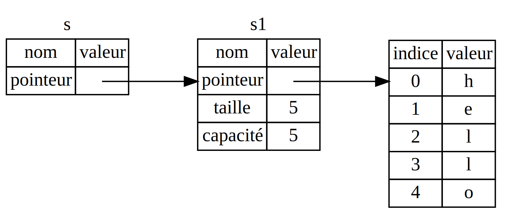

<!--
## References and Borrowing
-->

## Les références et l'emprunt

<!--
The issue with the tuple code in Listing 4-5 is that we have to return the
`String` to the calling function so we can still use the `String` after the
call to `calculate_length`, because the `String` was moved into
`calculate_length`.
-->

Le problème avec le code du tuple à la fin de la section précédente c'est que
nous avons besoin de retourner le `String` au code appelant pour qu'il puisse
encore utiliser le `String` après l'appel à `calculate_length`, car
l'appartenance du `String` a été déplacée dans `calculate_length`.

<!--
Here is how you would define and use a `calculate_length` function that has a
reference to an object as a parameter instead of taking ownership of the
value:
-->

Ici vous allez définir et utiliser une fonction `calculate_length` qui prend
une *référence* à un objet en paramètre plutôt que de s'approprier la valeur :

<!--
<span class="filename">Filename: src/main.rs</span>
-->

<span class="filename">Nom du fichier : src/main.rs</span>

<!--
```rust
fn main() {
    let s1 = String::from("hello");

    let len = calculate_length(&s1);

    println!("The length of '{}' is {}.", s1, len);
}

fn calculate_length(s: &String) -> usize {
    s.len()
}
```
-->

```rust
fn main() {
    let s1 = String::from("hello");

    let len = calculate_length(&s1);

    println!("The length of '{}' is {}.", s1, len);
}

fn calculate_length(s: &String) -> usize {
    s.len()
}
```

<!--
First, notice that all the tuple code in the variable declaration and the
function return value is gone. Second, note that we pass `&s1` into
`calculate_length` and, in its definition, we take `&String` rather than
`String`.
-->

Premièrement, remarquez que tout le code avec le tuple dans la déclaration des
variables et dans le retour de la fonction a été enlevé. Ensuite, on peut
constater que nous envoyons `&s1` dans `calculate_length`, et que dans sa
définition, nous utilisons `&String` plutôt que `String`.

<!--
These ampersands are *references*, and they allow you to refer to some value
without taking ownership of it. Figure 4-5 shows a diagram.
-->

Ces esperluettes sont des *références*, et elles permettent de vous référer à
une valeur sans se l'approprier. L'illustration 4-5 nous montre cela dans un
diagramme.



<!--
<span class="caption">Figure 4-5: A diagram of `&String s` pointing at `String
s1`</span>
-->

<span class="caption">Illustration 4-5 : `&String s` pointe sur `String s1`</span>

<!--
> Note: The opposite of referencing by using `&` is *dereferencing*, which is
> accomplished with the dereference operator, `*`. We’ll see some uses of the
> dereference operator in Chapter 8 and discuss details of dereferencing in
> Chapter 15.
-->

> Note : l'opposé du référencement en utilisant `&` est le *déréférencement*,
> qui est effectué par l'opérateur de déréférencement, `*`. Nous allons voir
> quelques utilisations de l'opérateur de déréférencement dans le Chapitre 8 et
> nous discuterons des détails du déréférencement dans le Chapitre 15.

<!--
Let’s take a closer look at the function call here:
-->

Regardons de plus près les appels de fonction utilisées :

<!--
```rust
# fn calculate_length(s: &String) -> usize {
#     s.len()
# }
let s1 = String::from("hello");

let len = calculate_length(&s1);
```
-->

```rust
# fn calculate_length(s: &String) -> usize {
#     s.len()
# }
let s1 = String::from("hello");

let len = calculate_length(&s1);
```

<!--
The `&s1` syntax lets us create a reference that *refers* to the value of `s1`
but does not own it. Because it does not own it, the value it points to will
not be dropped when the reference goes out of scope.
-->

La syntaxe `&s1` nous permet de créer une référence qui se *réfère* à la valeur
de `s1` mais ne s'approprie pas. Par ce qu'elle ne se l'approprie pas, la
valeur qu'elle désigne ne sera pas libérée quand la référence sortira de la
portée.

<!--
Likewise, the signature of the function uses `&` to indicate that the type of
the parameter `s` is a reference. Let’s add some explanatory annotations:
-->

De la même manière, la signature de la fonction utilise `&` pour indiquer que
le type de paramètre `s` est une référence. Ajoutons quelques commentaires
explicatifs :

<!--
```rust
fn calculate_length(s: &String) -> usize { // s is a reference to a String
    s.len()
} // Here, s goes out of scope. But because it does not have ownership of what
  // it refers to, nothing happens.
```
-->

```rust
fn calculate_length(s: &String) -> usize { // s est une référence à un String
    s.len()
} // Ici, s sort de la porté. Mais comme elle ne s'approprie pas ce dont elle
  // fait référence, il ne se passe rien.
```

<!--
The scope in which the variable `s` is valid is the same as any function
parameter’s scope, but we don’t drop what the reference points to when it goes
out of scope because we don’t have ownership. When functions have references as
parameters instead of the actual values, we won’t need to return the values in
order to give back ownership, because we never had ownership.
-->

La portée dans laquelle la variable `s` est en vigueur est la même que toute
portée de paramètre de fonction, mais nous ne libérons pas ce sur quoi cette
référence pointe quand elle sort de la portée, car nous ne nous l'avons pas
approprié. Les fonctions qui ont des références en paramètres au lieu des
valeurs effectives veulent dire que nous n'avons pas besoin de retourner les
valeurs pour rendre leur appartenance, puis nous n'avons jamais eu
l'appartenance.

<!--
We call having references as function parameters *borrowing*. As in real life,
if a person owns something, you can borrow it from them. When you’re done, you
have to give it back.
-->

Quand nous avons des références dans les paramètres d'une fonction, nous
appelons cela *l'emprunt*. Comme dans la vie réelle, quand un objet appartient
à quelqu'un, vous pouvez lui emprunter. Quand vous avez fini, vous devez lui
rendre.

<!--
So what happens if we try to modify something we’re borrowing? Try the code in
Listing 4-6. Spoiler alert: it doesn’t work!
-->

Donc qu'est-ce qui se passe si nous essayons de modifier quelque chose que nous
empruntons ? Essayez le code dans l'entrée 4-4. Spoiler : cela ne fonctionne
pas !

<!--
<span class="filename">Filename: src/main.rs</span>
-->

<span class="filename">Nom du fichier : src/main.rs</span>

<!--
```rust,ignore,does_not_compile
fn main() {
    let s = String::from("hello");

    change(&s);
}

fn change(some_string: &String) {
    some_string.push_str(", world");
}
```
-->

```rust,ignore
fn main() {
    let s = String::from("hello");

    change(&s);
}

fn change(some_string: &String) {
    some_string.push_str(", world");
}
```

<!--
<span class="caption">Listing 4-6: Attempting to modify a borrowed value</span>
-->

<span class="caption">Entrée 4-4: tentative de modification d'une valeur
empruntée.</span>

<!--
Here’s the error:
-->

Voici l'erreur :

<!--
```text
error[E0596]: cannot borrow immutable borrowed content `*some_string` as mutable
 -- > error.rs:8:5
  |
7 | fn change(some_string: &String) {
  |                        ------- use `&mut String` here to make mutable
8 |     some_string.push_str(", world");
  |     ^^^^^^^^^^^ cannot borrow as mutable
```
-->


```text
error[E0596]: cannot borrow immutable borrowed content `*some_string` as mutable
 --> error.rs:8:5
  |
7 | fn change(some_string: &String) {
  |                        ------- use `&mut String` here to make mutable
8 |     some_string.push_str(", world");
  |     ^^^^^^^^^^^ cannot borrow as mutable
```

<!--
Just as variables are immutable by default, so are references. We’re not
allowed to modify something we have a reference to.
-->

Comme les variables sont immuables par défaut, les références le sont aussi.
Nous ne sommes pas autorisés à modifier une chose quand nous avons une
référence vers elle.

<!--
### Mutable References
-->

### Les références modifiables

<!--
We can fix the error in the code from Listing 4-6 with just a small tweak:
-->

Nous pouvons résoudre l'erreur dans le code de l'entrée 4-4 avec une petite
modification :

<!--
<span class="filename">Filename: src/main.rs</span>
-->

<span class="filename">Nom de fichier : src/main.rs</span>

<!--
```rust
fn main() {
    let mut s = String::from("hello");

    change(&mut s);
}

fn change(some_string: &mut String) {
    some_string.push_str(", world");
}
```
-->

```rust
fn main() {
    let mut s = String::from("hello");

    change(&mut s);
}

fn change(some_string: &mut String) {
    some_string.push_str(", world");
}
```

<!--
First, we had to change `s` to be `mut`. Then we had to create a mutable
reference with `&mut s` and accept a mutable reference with `some_string: &mut
String`.
-->

Premièrement, nous devons modifier `s` pour être `mut`. Ensuite, nous devons
créer une référence modifiable avec `&mut s` et prendre une référence
modifiable avec `some_string: &mut String`.

<!--
But mutable references have one big restriction: you can have only one mutable
reference to a particular piece of data in a particular scope. This code will
fail:
-->

Mais les références modifiables ont une grosse restriction : vous ne pouvez
avoir qu'une seule référence modifiable pour un article de donnée précis dans
une portée précise. Le code suivant va échouer :

<!--
<span class="filename">Filename: src/main.rs</span>
-->

<span class="filename">Nom de fichier : src/main.rs</span>

<!--
```rust,ignore,does_not_compile
let mut s = String::from("hello");

let r1 = &mut s;
let r2 = &mut s;

println!("{}, {}", r1, r2);
```
-->

```rust,ignore
let mut s = String::from("hello");

let r1 = &mut s;
let r2 = &mut s;
```

<!--
Here’s the error:
-->

Voici l'erreur :

<!--
```text
error[E0499]: cannot borrow `s` as mutable more than once at a time
 -- > src/main.rs:5:14
  |
4 |     let r1 = &mut s;
  |              ------ first mutable borrow occurs here
5 |     let r2 = &mut s;
  |              ^^^^^^ second mutable borrow occurs here
6 |
7 |     println!("{}, {}", r1, r2);
  |                        -- first borrow later used here
```
-->

```text
error[E0499]: cannot borrow `s` as mutable more than once at a time
 --> borrow_twice.rs:5:19
  |
4 |     let r1 = &mut s;
  |                   - first mutable borrow occurs here
5 |     let r2 = &mut s;
  |                   ^ second mutable borrow occurs here
6 | }
  | - first borrow ends here
```

<!--
This restriction allows for mutation but in a very controlled fashion. It’s
something that new Rustaceans struggle with, because most languages let you
mutate whenever you’d like.
-->

Cette restriction autorise les mutations, mais de façon très contrôlée. C'est
ce avec quoi les nouveaux Rustacéens ont du mal, car la plupart des langages
vous permettent de modifier les données quand vous voulez. L'avantage de cette
restriction c'est que Rust peut empêcher la concurrence des données au moment
de la compilation.

<!--
The benefit of having this restriction is that Rust can prevent data races at
compile time. A *data race* is similar to a race condition and happens when
these three behaviors occur:
-->

La *concurrence des données* ressemble à une concurrence critique et se produit
quand ces trois facteurs se combinent :

<!--
* Two or more pointers access the same data at the same time.
* At least one of the pointers is being used to write to the data.
* There’s no mechanism being used to synchronize access to the data.
-->

1. Un ou plusieurs pointeurs accèdent à la même donnée au même moment.
2. Au moins un des pointeurs est utilisé pour écrire dans les données.
3. On n'utilise pas de processus pour synchroniser l'accès aux données.

<!--
Data races cause undefined behavior and can be difficult to diagnose and fix
when you’re trying to track them down at runtime; Rust prevents this problem
from happening because it won’t even compile code with data races!
-->

La concurrence des données provoque des comportements inexpliqués et il peut
alors être difficile de diagnostiquer et résoudre le problème lorsque vous
essayez de les traquer au moment de l'exécution; Rust évite que ce problème
arrive parcequ'il ne va même pas compiler le code avec de la concurrence de
données !

<!--
As always, we can use curly brackets to create a new scope, allowing for
multiple mutable references, just not *simultaneous* ones:
-->

Comme toujours, nous pouvons utiliser des accolades pour créer une nouvelle
portée, pour nous permettre d'avoir plusieurs références modifiables, mais pas
*simultanées* :

<!--
```rust
let mut s = String::from("hello");

{
    let r1 = &mut s;

} // r1 goes out of scope here, so we can make a new reference with no problems.

let r2 = &mut s;
```
-->

```rust
let mut s = String::from("hello");

{
    let r1 = &mut s;

} // r1 sort de la portée ici, donc nous pouvons faire une nouvelle référence
  // sans problèmes.

let r2 = &mut s;
```

<!--
A similar rule exists for combining mutable and immutable references. This code
results in an error:
-->

Une règle similaire existe pour mélanger les références immuables et
modifiables. Ce code va mener à une erreur :

<!--
```rust,ignore,does_not_compile
let mut s = String::from("hello");

let r1 = &s; // no problem
let r2 = &s; // no problem
let r3 = &mut s; // BIG PROBLEM

println!("{}, {}, and {}", r1, r2, r3);
```
-->

```rust,ignore
let mut s = String::from("hello");

let r1 = &s; // sans problème
let r2 = &s; // sans problème
let r3 = &mut s; // GROS PROBLEME
```

<!--
Here’s the error:
-->

Voici l'erreur :

<!--
```text
error[E0502]: cannot borrow `s` as mutable because it is also borrowed as immutable
 -- > src/main.rs:6:14
  |
4 |     let r1 = &s; // no problem
  |              -- immutable borrow occurs here
5 |     let r2 = &s; // no problem
6 |     let r3 = &mut s; // BIG PROBLEM
  |              ^^^^^^ mutable borrow occurs here
7 |
8 |     println!("{}, {}, and {}", r1, r2, r3);
  |                                -- immutable borrow later used here
```
-->

```text
error[E0502]: cannot borrow `s` as mutable because it is also borrowed as
immutable
 --> borrow_thrice.rs:6:19
  |
4 |     let r1 = &s; // no problem
  |               - immutable borrow occurs here
5 |     let r2 = &s; // no problem
6 |     let r3 = &mut s; // BIG PROBLEM
  |                   ^ mutable borrow occurs here
7 | }
  | - immutable borrow ends here
```

<!--
Whew! We *also* cannot have a mutable reference while we have an immutable one.
Users of an immutable reference don’t expect the values to suddenly change out
from under them! However, multiple immutable references are okay because no one
who is just reading the data has the ability to affect anyone else’s reading of
the data.
-->

Ouah ! Nous ne pouvons pas *non plus* avoir une référence modifiable si nous en
avons une d'immuable. Les utilisateurs d'une référence immuable ne s'attendent
pas à ce que se valeur change soudainement ! Cependant, l'utilisation de
plusieurs références immuables ne pose pas de problème, car personne de ceux
qui lisent uniquement la donnée n'a la possibilité de modifier la lecture de la
donnée par les autres.

<!--
Note that a reference’s scope starts from where it is introduced and continues
through the last time that reference is used. For instance, this code will
compile because the last usage of the immutable references occurs before the
mutable reference is introduced:
-->

Même si ces erreurs peuvent parfois être frustrantes, souvenez-vous que le
compilateur de Rust nous fait remarquer un futur bogue avant l'heure (au moment
de la compilation plutôt que lors de l'exécution) et vous montre où est
exactement le problème plutôt que vous ayez à traquer pourquoi *des fois* vos
données ne correspondent pas à ce que vous pensiez qu'elles étaient.

<!-- This example is being ignored because there's a bug in rustdoc making the
edition2018 not work. The bug is currently fixed in nightly, so when we update
the book to >= 1.35, `ignore` can be removed from this example. -->

<!--
```rust,edition2018,ignore
let mut s = String::from("hello");

let r1 = &s; // no problem
let r2 = &s; // no problem
println!("{} and {}", r1, r2);
// r1 and r2 are no longer used after this point

let r3 = &mut s; // no problem
println!("{}", r3);
```
-->

```rust,edition2018,ignore
let mut s = String::from("hello");

let r1 = &s; // no problem
let r2 = &s; // no problem
println!("{} and {}", r1, r2);
// r1 and r2 are no longer used after this point

let r3 = &mut s; // no problem
println!("{}", r3);
```

<!--
The scopes of the immutable references `r1` and `r2` end after the `println!`
where they are last used, which is before the mutable reference `r3` is
created. These scopes don’t overlap, so this code is allowed.
-->

The scopes of the immutable references `r1` and `r2` end after the `println!`
where they are last used, which is before the mutable reference `r3` is
created. These scopes don’t overlap, so this code is allowed.

<!--
Even though borrowing errors may be frustrating at times, remember that it’s
the Rust compiler pointing out a potential bug early (at compile time rather
than at runtime) and showing you exactly where the problem is. Then you don’t
have to track down why your data isn’t what you thought it was.
-->

Even though borrowing errors may be frustrating at times, remember that it’s
the Rust compiler pointing out a potential bug early (at compile time rather
than at runtime) and showing you exactly where the problem is. Then you don’t
have to track down why your data isn’t what you thought it was.

<!--
### Dangling References
-->

### Références en suspension

<!--
In languages with pointers, it’s easy to erroneously create a *dangling
pointer*, a pointer that references a location in memory that may have been
given to someone else, by freeing some memory while preserving a pointer to
that memory. In Rust, by contrast, the compiler guarantees that references will
never be dangling references: if you have a reference to some data, the
compiler will ensure that the data will not go out of scope before the
reference to the data does.
-->

Avec les langages qui utilisent les pointeurs, c'est facile de créer par erreur
un *pointeur en suspension*, qui est un pointeur qui désigne un endroit dans la
mémoire qui a été donné par quelqu'un d'autre, en libérant une partie de la
mémoire, mais en conservant un pointeur vers cette mémoire. En revanche, dans
Rust, le compilateur garantie que les références ne seront jamais des
références en suspension : si nous avons une référence vers des données, le
compilateur va s'assurer que cette donnée ne vas pas sortir de la portée avant
que la référence vers cette donnée soit sortie.

<!--
Let’s try to create a dangling reference, which Rust will prevent with a
compile-time error:
-->

Essayons de créer une référence en suspension, que Rust va empêcher avec une
erreur au moment de la compilation :

<!--
<span class="filename">Filename: src/main.rs</span>
-->

<span class="filename">Nom du fichier : src/main.rs</span>

<!--
```rust,ignore,does_not_compile
fn main() {
    let reference_to_nothing = dangle();
}

fn dangle() -> &String {
    let s = String::from("hello");

    &s
}
```
-->

```rust,ignore
fn main() {
    let reference_to_nothing = dangle();
}

fn dangle() -> &String {
    let s = String::from("hello");

    &s
}
```

<!--
Here’s the error:
-->

Voici l'erreur :

<!--
```text
error[E0106]: missing lifetime specifier
 -- > main.rs:5:16
  |
5 | fn dangle() -> &String {
  |                ^ expected lifetime parameter
  |
  = help: this function's return type contains a borrowed value, but there is
  no value for it to be borrowed from
  = help: consider giving it a 'static lifetime
```
-->

```text
error[E0106]: missing lifetime specifier
 --> dangle.rs:5:16
  |
5 | fn dangle() -> &String {
  |                ^ expected lifetime parameter
  |
  = help: this function's return type contains a borrowed value, but there is
  no value for it to be borrowed from
  = help: consider giving it a 'static lifetime
```

<!--
This error message refers to a feature we haven’t covered yet: lifetimes. We’ll
discuss lifetimes in detail in Chapter 10. But, if you disregard the parts
about lifetimes, the message does contain the key to why this code is a problem:
-->

Ce message d'erreur parle d'une fonctionnalité que nous n'avons pas encore vu :
les *durées de vie*. Nous allons voir plus en détail les durées de vie dans le
Chapitre 10. Mais, si vous mettez de côté les parties qui parlent de la durée
de vie, le message désigne l'élément de code qui pose problème :

<!--
```text
this function's return type contains a borrowed value, but there is no value
for it to be borrowed from.
```
-->

```text
this function's return type contains a borrowed value, but there is no value
for it to be borrowed from.
```

<!--
Let’s take a closer look at exactly what’s happening at each stage of our
`dangle` code:
-->

Regardons de plus près ce qui se passe à chaque étape de notre code `dangle` :

<!--
<span class="filename">Filename: src/main.rs</span>
-->

<span class="filename">Filename: src/main.rs</span>

<!--
```rust,ignore
fn dangle() -> &String { // dangle returns a reference to a String

    let s = String::from("hello"); // s is a new String

    &s // we return a reference to the String, s
} // Here, s goes out of scope, and is dropped. Its memory goes away.
  // Danger!
```
-->


```rust,ignore
fn dangle() -> &String { // dangle returnes une référence vers un String

    let s = String::from("hello"); // s est un nouveau String

    &s // nous retournons une référence vers le String, s
} // Ici, s sort de la portée, et est libéré. Sa mémoire disparait. Danger !
```

<!--
Because `s` is created inside `dangle`, when the code of `dangle` is finished,
`s` will be deallocated. But we tried to return a reference to it. That means
this reference would be pointing to an invalid `String`. That’s no good! Rust
won’t let us do this.
-->

Parce que `s` est créé dans `dangle`, quand le code de `dangle` est terminé,
`s` va être désaloué. Mais nous avions essayé de renvoyer une référence vers
elle. Cela veut dire que cette référence va pointer vers un `String` invalide !
Ce n'est pas bon. Rust ne nous laissera pas faire cela.

<!--
The solution here is to return the `String` directly:
-->

Ici la solution est de renvoyer le `String` directement :

<!--
```rust
fn no_dangle() -> String {
    let s = String::from("hello");

    s
}
```
-->

```rust
fn no_dangle() -> String {
    let s = String::from("hello");

    s
}
```

<!--
This works without any problems. Ownership is moved out, and nothing is
deallocated.
-->

Cela fonctionne sans problème. L'appartenance est déplacée, et rien n'est
désaloué.

<!--
### The Rules of References
-->

### Les règles de référencement

<!--
Let’s recap what we’ve discussed about references:
-->

Récapitulons ce que nous avons vu à propos des références :

<!--
* At any given time, you can have *either* one mutable reference *or* any
  number of immutable references.
* References must always be valid.
-->

1. Vous pouvez avoir *un* des deux cas suivants, mais pas les deux en même
temps :
  * Une référence modifiable.
  * Un nombre illimité de références immuables.
2. Les références doivent toujours être en vigueur.

<!--
Next, we’ll look at a different kind of reference: slices.
-->

A l'étape suivante, nous allons aborder un type différent de référence : les
slices.
