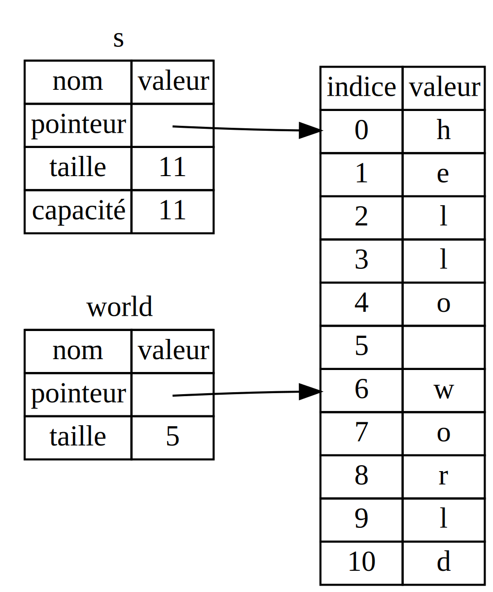

<!--
## The Slice Type
-->

## Le type slice

<!--
Another data type that does not have ownership is the *slice*. Slices let you
reference a contiguous sequence of elements in a collection rather than the
whole collection.
-->

Un autre type de donnée qui ne prend pas possession est la *slice*. Une slice
vous permet d'obtenir une référence vers une séquence continue d'éléments d'une
collection plutôt que toute la collection.

<!--
Here’s a small programming problem: write a function that takes a string and
returns the first word it finds in that string. If the function doesn’t find a
space in the string, the whole string must be one word, so the entire string
should be returned.
-->

Voici un petit problème de programmation : écrire une fonction qui prend une
chaîne de caractères et retourne le premier mot qu'elle trouve dans cette
chaîne. Si la fonction ne trouve pas d'espace dans la chaîne, cela veut dire
que la chaîne est en un seul mot, donc la chaîne en entier doit être retournée.

<!--
Let’s think about the signature of this function:
-->

Imaginons la signature de cette fonction :

<!--
```rust,ignore
fn first_word(s: &String) -> ?
```
-->

```rust,ignore
fn premier_mot(s: &String) -> ?
```

<!--
This function, `first_word`, has a `&String` as a parameter. We don’t want
ownership, so this is fine. But what should we return? We don’t really have a
way to talk about *part* of a string. However, we could return the index of the
end of the word. Let’s try that, as shown in Listing 4-7.
-->

Cette fonction, `premier_mot`, prend un `&String` comme paramètre. Nous ne
voulons pas en prendre possession, donc c'est ce qu'il nous faut. Mais que
devons-nous retourner ? Nous n'avons aucun moyen de désigner une *partie*
d'une chaîne de caractères. Cependant, nous pouvons retourner l'indice de la
fin du mot. Essayons cela, dans l'encart 4-7 :

<!--
<span class="filename">Filename: src/main.rs</span>
-->

<span class="filename">Fichier : src/main.rs</span>

<!--
```rust
{{#rustdoc_include ../listings-sources/ch04-understanding-ownership/listing-04-07/src/main.rs:here}}
```
-->

```rust
{{#rustdoc_include ../listings/ch04-understanding-ownership/listing-04-07/src/main.rs:here}}
```

<!--
<span class="caption">Listing 4-7: The `first_word` function that returns a
byte index value into the `String` parameter</span>
-->

<span class="caption">Encart 4-7 : La fonction `premier_mot` qui retourne
l'indice d'un octet provenant du paramètre `String`</span>

<!--
Because we need to go through the `String` element by element and check whether
a value is a space, we’ll convert our `String` to an array of bytes using the
`as_bytes` method:
-->

Comme nous avons besoin de parcourir la `String` élément par élément et de
vérifier si la valeur est une espace, nous convertissons notre `String` en un
tableau d'octets en utilisant la méthode `as_bytes` :

<!--
```rust,ignore
{{#rustdoc_include ../listings-sources/ch04-understanding-ownership/listing-04-07/src/main.rs:as_bytes}}
```
-->

```rust,ignore
{{#rustdoc_include ../listings/ch04-understanding-ownership/listing-04-07/src/main.rs:as_bytes}}
```

<!--
Next, we create an iterator over the array of bytes using the `iter` method:
-->

Ensuite, nous créons un itérateur sur le tableau d'octets en utilisant la
méthode `iter` :

<!--
```rust,ignore
{{#rustdoc_include ../listings-sources/ch04-understanding-ownership/listing-04-07/src/main.rs:iter}}
```
-->

```rust,ignore
{{#rustdoc_include ../listings/ch04-understanding-ownership/listing-04-07/src/main.rs:iter}}
```

<!--
We’ll discuss iterators in more detail in Chapter 13. For now, know that `iter`
is a method that returns each element in a collection and that `enumerate`
wraps the result of `iter` and returns each element as part of a tuple instead.
The first element of the tuple returned from `enumerate` is the index, and the
second element is a reference to the element. This is a bit more convenient
than calculating the index ourselves.
-->

Nous aborderons plus en détail les itérateurs dans le chapitre 13. Pour le
moment, sachez que `iter` est une méthode qui retourne chaque élément d'une
collection, et que `enumerate` transforme le résultat de `iter` pour retourner
plutôt chaque élément comme un tuple. Le premier élément du tuple retourné par
`enumerate` est l'indice, et le second élément est une référence vers l'élément.
C'est un peu plus pratique que de calculer les indices par nous-mêmes.

<!--
Because the `enumerate` method returns a tuple, we can use patterns to
destructure that tuple, just like everywhere else in Rust. So in the `for`
loop, we specify a pattern that has `i` for the index in the tuple and `&item`
for the single byte in the tuple. Because we get a reference to the element
from `.iter().enumerate()`, we use `&` in the pattern.
-->

Comme la méthode `enumerate` retourne un tuple, nous pouvons utiliser des motifs
pour déstructurer ce tuple, comme nous pourrions le faire n'importe où avec
Rust. Donc dans la boucle `for`, nous précisons un motif qui indique que nous
définissons `i` pour l'indice au sein du tuple et `&element` pour l'octet dans
le tuple. Comme nous obtenons une référence vers l'élément avec
`.iter().enumerate()`, nous utilisons `&` dans le motif.

<!--
Inside the `for` loop, we search for the byte that represents the space by
using the byte literal syntax. If we find a space, we return the position.
Otherwise, we return the length of the string by using `s.len()`:
-->

Au sein de la boucle `for`, nous recherchons l'octet qui représente l'espace en
utilisant la syntaxe de littéral d'octet. Si nous trouvons une espace, nous
retournons sa position. Sinon, nous retournons la taille de la chaîne en
utilisant `s.len()` :

<!--
```rust,ignore
{{#rustdoc_include ../listings-sources/ch04-understanding-ownership/listing-04-07/src/main.rs:inside_for}}
```
-->

```rust,ignore
{{#rustdoc_include ../listings/ch04-understanding-ownership/listing-04-07/src/main.rs:inside_for}}
```

<!--
We now have a way to find out the index of the end of the first word in the
string, but there’s a problem. We’re returning a `usize` on its own, but it’s
only a meaningful number in the context of the `&String`. In other words,
because it’s a separate value from the `String`, there’s no guarantee that it
will still be valid in the future. Consider the program in Listing 4-8 that
uses the `first_word` function from Listing 4-7.
-->

Nous avons maintenant une façon de trouver l'indice de la fin du premier mot
dans la chaîne de caractères, mais il y a un problème. Nous retournons un
`usize` tout seul, mais il n'a du sens que lorsqu'il est lié au `&String`.
Autrement dit, comme il a une valeur séparée de la `String`, il n'y a pas de
garantie qu'il restera toujours valide dans le futur. Imaginons le programme
dans l'encart 4-8 qui utilise la fonction `premier_mot` de l'encart 4-7 :

<!--
<span class="filename">Filename: src/main.rs</span>
-->

<span class="filename">Fichier : src/main.rs</span>

<!--
```rust
{{#rustdoc_include ../listings-sources/ch04-understanding-ownership/listing-04-08/src/main.rs:here}}
```
-->

```rust
{{#rustdoc_include ../listings/ch04-understanding-ownership/listing-04-08/src/main.rs:here}}
```

<!--
<span class="caption">Listing 4-8: Storing the result from calling the
`first_word` function and then changing the `String` contents</span>
-->

<span class="caption">Encart 4-8 : On stocke le résultat de l'appel à la
fonction `premier_mot` et ensuite on change le contenu de la `String`</span>

<!--
This program compiles without any errors and would also do so if we used `word`
after calling `s.clear()`. Because `word` isn’t connected to the state of `s`
at all, `word` still contains the value `5`. We could use that value `5` with
the variable `s` to try to extract the first word out, but this would be a bug
because the contents of `s` have changed since we saved `5` in `word`.
-->

Ce programme se compile sans aucune erreur et le ferait toujours si nous
utilisions `mot` après avoir appelé `s.clear()`. Comme `mot` n'est pas du tout
lié à `s`, `mot` contient toujours la valeur `5`. Nous pourrions utiliser cette
valeur `5` avec la variable `s` pour essayer d'en extraire le premier mot, mais
cela serait un bogue, car le contenu de `s` a changé depuis que nous avons
enregistré `5` dans `mot`.

<!--
Having to worry about the index in `word` getting out of sync with the data in
`s` is tedious and error prone! Managing these indices is even more brittle if
we write a `second_word` function. Its signature would have to look like this:
-->

Se préoccuper en permanence que l'indice présent dans `mot` ne soit plus
synchronisé avec les données présentes dans `s` est fastidieux et source
d'erreur ! La gestion de ces indices est encore plus risquée si nous écrivons
une fonction `second_mot`. Sa signature ressemblerait à ceci :

<!--
```rust,ignore
fn second_word(s: &String) -> (usize, usize) {
```
-->

```rust,ignore
fn second_mot(s: &String) -> (usize, usize) {
```

<!--
Now we’re tracking a starting *and* an ending index, and we have even more
values that were calculated from data in a particular state but aren’t tied to
that state at all. We now have three unrelated variables floating around that
need to be kept in sync.
-->

Maintenant, nous avons un indice de début *et* un indice de fin, donc nous avons
encore plus de valeurs qui sont calculées à partir d'une donnée dans un état
donné, mais qui ne sont pas liées du tout à l'état de cette donnée. Nous avons
maintenant trois variables isolées qui ont besoin d'être maintenues à jour.

<!--
Luckily, Rust has a solution to this problem: string slices.
-->

Heureusement, Rust a une solution pour ce problème : les *slices* de chaînes de
caractères.

<!--
### String Slices
-->

### Les slices de chaînes de caractères

<!--
A *string slice* is a reference to part of a `String`, and it looks like this:
-->

Une *slice de chaîne de caractères* (ou *slice de chaîne*) est une référence à
une partie d'une `String`, et ressemble à ceci :

<!--
```rust
{{#rustdoc_include ../listings-sources/ch04-understanding-ownership/no-listing-17-slice/src/main.rs:here}}
```
-->

```rust
{{#rustdoc_include ../listings/ch04-understanding-ownership/no-listing-17-slice/src/main.rs:here}}
```

<!--
This is similar to taking a reference to the whole `String` but with the extra
`[0..5]` bit. Rather than a reference to the entire `String`, it’s a reference
to a portion of the `String`.
-->

Cela ressemble à une référence pour toute la `String`, mais avec la partie
`[0..5]` en plus. Plutôt que d'être une référence vers toute la `String`, c'est
une référence vers une partie de la `String`.

<!-- markdownlint-disable -->
<!--
We can create slices using a range within brackets by specifying
`[starting_index..ending_index]`, where `starting_index` is the first position
in the slice and `ending_index` is one more than the last position in the
slice. Internally, the slice data structure stores the starting position and
the length of the slice, which corresponds to `ending_index` minus
`starting_index`. So in the case of `let world = &s[6..11];`, `world` would be
a slice that contains a pointer to the 7th byte (counting from 1) of `s` with a length value of 5.
-->
<!-- markdownlint-enable -->

Nous pouvons créer des slices en utilisant un intervalle entre crochets en
spécifiant `[indice_debut..indice_fin]`, où `indice_debut` est la position du
premier octet de la slice et `indice_fin` est la position juste après le dernier
octet de la slice. En interne, la structure de données de la slice stocke la
position de départ et la longueur de la slice, ce qui correspond à `indice_fin`
moins `indice_debut`. Donc dans le cas de `let world = &s[6..11];`, `world` est
une slice qui contient un pointeur vers le septième octet (en comptant à partir
de 1) de `s` et une longueur de 5.

<!--
Figure 4-6 shows this in a diagram.
-->

L'illustration 4-6 montre ceci dans un schéma.

<!-- markdownlint-disable -->
<!--

-->
<!-- markdownlint-restore -->


<!--
<span class="caption">Figure 4-6: String slice referring to part of a
`String`</span>
-->

<span class="caption">Illustration 4-6 : Une slice de chaîne qui pointe vers
une partie d'une `String`</span>

<!--
With Rust’s `..` range syntax, if you want to start at the first index (zero),
you can drop the value before the two periods. In other words, these are equal:
-->

Avec la syntaxe d'intervalle `..` de Rust, si vous voulez commencer au premier
indice (zéro), vous pouvez ne rien mettre avant les deux points. Autrement dit,
ces deux cas sont identiques :

<!--
```rust
let s = String::from("hello");

let slice = &s[0..2];
let slice = &s[..2];
```
-->

```rust
let s = String::from("hello");

let slice = &s[0..2];
let slice = &s[..2];
```

<!--
By the same token, if your slice includes the last byte of the `String`, you
can drop the trailing number. That means these are equal:
-->

De la même manière, si votre slice contient le dernier octet de la `String`,
vous pouvez ne rien mettre à la fin. Cela veut dire que ces deux cas sont
identiques :

<!--
```rust
let s = String::from("hello");

let len = s.len();

let slice = &s[3..len];
let slice = &s[3..];
```
-->

```rust
let s = String::from("hello");

let taille = s.len();

let slice = &s[3..taille];
let slice = &s[3..];
```

<!--
You can also drop both values to take a slice of the entire string. So these
are equal:
-->

Vous pouvez aussi ne mettre aucune limite pour créer une slice de toute la
chaîne de caractères. Ces deux cas sont donc identiques :

<!--
```rust
let s = String::from("hello");

let len = s.len();

let slice = &s[0..len];
let slice = &s[..];
```
-->

```rust
let s = String::from("hello");

let taille = s.len();

let slice = &s[0..taille];
let slice = &s[..];
```

<!--
> Note: String slice range indices must occur at valid UTF-8 character
> boundaries. If you attempt to create a string slice in the middle of a
> multibyte character, your program will exit with an error. For the purposes
> of introducing string slices, we are assuming ASCII only in this section; a
> more thorough discussion of UTF-8 handling is in the [“Storing UTF-8 Encoded
> Text with Strings”][strings]<!-- ignore -- > section of Chapter 8.
-->

> Remarque : Les indices de l'intervalle d'une slice de chaîne doivent toujours
> se trouver dans les zones acceptables de séparation des caractères encodés en
> UTF-8. Si vous essayez de créer une slice de chaîne qui s'arrête au milieu
> d'un caractère encodé sur plusieurs octets, votre programme va se fermer avec
> une erreur. Afin de simplifier l'explication des slices de chaînes, nous
> utiliserons uniquement l'ASCII dans cette section ; nous verrons la gestion
> d'UTF-8 dans la section [“Stocker du texte encodé en UTF-8 avec les chaînes de
> caractères”][strings]<!-- ignore --> du chapitre 8.

<!--
With all this information in mind, let’s rewrite `first_word` to return a
slice. The type that signifies “string slice” is written as `&str`:
-->

Maintenant que nous savons tout cela, essayons de réécrire `premier_mot` pour
qu'il retourne une slice. Le type pour les slices de chaînes de caractères
s'écrit `&str` :

<!--
<span class="filename">Filename: src/main.rs</span>
-->

<span class="filename">Fichier : src/main.rs</span>

<!--
```rust
{{#rustdoc_include ../listings-sources/ch04-understanding-ownership/no-listing-18-first-word-slice/src/main.rs:here}}
```
-->

```rust
{{#rustdoc_include ../listings/ch04-understanding-ownership/no-listing-18-first-word-slice/src/main.rs:here}}
```

<!--
We get the index for the end of the word in the same way as we did in Listing
4-7, by looking for the first occurrence of a space. When we find a space, we
return a string slice using the start of the string and the index of the space
as the starting and ending indices.
-->

Nous récupérons l'indice de la fin du mot de la même façon que nous l'avions
fait dans l'encart 4-7, en cherchant la première occurrence d'une espace.
Lorsque nous trouvons une espace, nous retournons une slice de chaîne en
utilisant le début de la chaîne de caractères et l'indice de l'espace comme
indices de début et de fin respectivement.

<!--
Now when we call `first_word`, we get back a single value that is tied to the
underlying data. The value is made up of a reference to the starting point of
the slice and the number of elements in the slice.
-->

Désormais, quand nous appelons `premier_mot`, nous récupérons une unique valeur
qui est liée à la donnée de base. La valeur se compose d'une référence vers le
point de départ de la slice et du nombre d'éléments dans la slice.

<!--
Returning a slice would also work for a `second_word` function:
-->

Retourner une slice fonctionnerait aussi pour une fonction `second_mot` :

<!--
```rust,ignore
fn second_word(s: &String) -> &str {
```
-->

```rust,ignore
fn second_mot(s: &String) -> &str {
```

<!--
We now have a straightforward API that’s much harder to mess up, because the
compiler will ensure the references into the `String` remain valid. Remember
the bug in the program in Listing 4-8, when we got the index to the end of the
first word but then cleared the string so our index was invalid? That code was
logically incorrect but didn’t show any immediate errors. The problems would
show up later if we kept trying to use the first word index with an emptied
string. Slices make this bug impossible and let us know we have a problem with
our code much sooner. Using the slice version of `first_word` will throw a
compile-time error:
-->

Nous avons maintenant une API simple qui est bien plus difficile à mal utiliser,
puisque le compilateur va s'assurer que les références dans la `String` seront
toujours en vigueur. Vous souvenez-vous du bogue du programme de l'encart 4-8,
lorsque nous avions un indice vers la fin du premier mot mais qu'ensuite nous
avions vidé la chaîne de caractères et que notre indice n'était plus valide ? Ce
code était logiquement incorrect, mais ne montrait pas immédiatement une erreur.
Les problèmes apparaîtront plus tard si nous essayons d'utiliser l'indice du
premier mot avec une chaîne de caractères qui a été vidée. Les slices rendent ce
bogue impossible et nous signalent bien plus tôt que nous avons un problème avec
notre code. Utiliser la version avec la slice de `premier_mot` va causer une
erreur de compilation :

<!--
<span class="filename">Filename: src/main.rs</span>
-->

<span class="filename">Fichier : src/main.rs</span>

<!--
```rust,ignore,does_not_compile
{{#rustdoc_include ../listings-sources/ch04-understanding-ownership/no-listing-19-slice-error/src/main.rs:here}}
```
-->

```rust,ignore,does_not_compile
{{#rustdoc_include ../listings/ch04-understanding-ownership/no-listing-19-slice-error/src/main.rs:here}}
```

<!--
Here’s the compiler error:
-->

Voici l'erreur du compilateur :

<!--
```console
{{#include ../listings-sources/ch04-understanding-ownership/no-listing-19-slice-error/output.txt}}
```
-->

```console
{{#include ../listings/ch04-understanding-ownership/no-listing-19-slice-error/output.txt}}
```

<!--
Recall from the borrowing rules that if we have an immutable reference to
something, we cannot also take a mutable reference. Because `clear` needs to
truncate the `String`, it needs to get a mutable reference. Rust disallows
this, and compilation fails. Not only has Rust made our API easier to use, but
it has also eliminated an entire class of errors at compile time!
-->

Rappelons-nous que d'après les règles d'emprunt, si nous avons une référence
immuable vers quelque chose, nous ne pouvons pas avoir une référence mutable
en même temps. Étant donné que `clear` a besoin de modifier la `String`, il a
besoin d'une référence mutable. Rust interdit cette situation, et la compilation
échoue. Non seulement Rust a simplifié l'utilisation de notre API, mais il a
aussi éliminé une catégorie entière d'erreurs au moment de la compilation !

<!--
#### String Literals Are Slices
-->

#### Les littéraux de chaîne de caractères sont aussi des slices

<!--
Recall that we talked about string literals being stored inside the binary. Now
that we know about slices, we can properly understand string literals:
-->

Rappelez-vous lorsque nous avons appris que les littéraux de chaîne de
caractères étaient enregistrés dans le binaire. Maintenant que nous connaissons
les slices, nous pouvons désormais comprendre les littéraux de chaîne.

<!--
```rust
let s = "Hello, world!";
```
-->

```rust
let s = "Hello, world!";
```

<!--
The type of `s` here is `&str`: it’s a slice pointing to that specific point of
the binary. This is also why string literals are immutable; `&str` is an
immutable reference.
-->

Ici, le type de `s` est un `&str` : c'est une slice qui pointe vers un endroit
précis du binaire. C'est aussi la raison pour laquelle les littéraux de chaîne
sont immuables ; `&str` est une référence immuable.

<!--
#### String Slices as Parameters
-->

#### Les slices de chaînes de caractères en paramètres

<!--
Knowing that you can take slices of literals and `String` values leads us to
one more improvement on `first_word`, and that’s its signature:
-->

Savoir que l'on peut utiliser des slices de littéraux et de `String` nous incite
à apporter une petite amélioration à `premier_mot`, dont voici la signature :

<!--
```rust,ignore
fn first_word(s: &String) -> &str {
```
-->

```rust,ignore
fn premier_mot(s: &String) -> &str {
```

<!--
A more experienced Rustacean would write the signature shown in Listing 4-9
instead because it allows us to use the same function on both `&String` values
and `&str` values.
-->

Un Rustacé plus expérimenté écrirait plutôt la signature de l'encart 4-9, car
cela nous permet d'utiliser la même fonction sur les `&String` et aussi les
`&str` :

<!--
```rust,ignore
{{#rustdoc_include ../listings-sources/ch04-understanding-ownership/listing-04-09/src/main.rs:here}}
```
-->

```rust,ignore
{{#rustdoc_include ../listings/ch04-understanding-ownership/listing-04-09/src/main.rs:here}}
```

<!--
<span class="caption">Listing 4-9: Improving the `first_word` function by using
a string slice for the type of the `s` parameter</span>
-->

<span class="caption">Encart 4-9 : Amélioration de la fonction `premier_mot` en
utilisant une slice de chaîne de caractères comme type du paramètre `s`</span>

<!--
If we have a string slice, we can pass that directly. If we have a `String`, we
can pass a slice of the entire `String`. Defining a function to take a string
slice instead of a reference to a `String` makes our API more general and useful
without losing any functionality:
-->

Si nous avons une slice de chaîne, nous pouvons la passer en argument
directement. Si nous avons une `String`, nous pouvons envoyer une slice de toute
la `String`. Définir une fonction qui prend une slice de chaîne plutôt qu'une
référence à une `String` rend notre API plus générique et plus utile sans perdre
aucune fonctionnalité :

<!--
<span class="filename">Filename: src/main.rs</span>
-->

<span class="filename">Fichier : src/main.rs</span>

<!--
```rust
{{#rustdoc_include ../listings-sources/ch04-understanding-ownership/listing-04-09/src/main.rs:usage}}
```
-->

```rust
{{#rustdoc_include ../listings/ch04-understanding-ownership/listing-04-09/src/main.rs:usage}}
```

<!--
### Other Slices
-->

### Les autres slices

<!--
String slices, as you might imagine, are specific to strings. But there’s a
more general slice type, too. Consider this array:
-->

Les slices de chaînes de caractères, comme vous pouvez l'imaginer, sont
spécifiques aux chaînes de caractères. Mais il existe aussi un type de slice
plus générique. Imaginons ce tableau de données :

<!--
```rust
let a = [1, 2, 3, 4, 5];
```
-->

```rust
let a = [1, 2, 3, 4, 5];
```

<!--
Just as we might want to refer to a part of a string, we might want to refer
to part of an array. We’d do so like this:
-->

Tout comme nous pouvons nous référer à une partie d'une chaîne de caractères,
nous pouvons nous référer à une partie d'un tableau. Nous pouvons le faire comme
ceci :

<!--
```rust
let a = [1, 2, 3, 4, 5];

let slice = &a[1..3];

assert_eq!(slice, &[2, 3]);
```
-->

```rust
let a = [1, 2, 3, 4, 5];

let slice = &a[1..3];

assert_eq!(slice, &[2, 3]);
```

<!--
This slice has the type `&[i32]`. It works the same way as string slices do, by
storing a reference to the first element and a length. You’ll use this kind of
slice for all sorts of other collections. We’ll discuss these collections in
detail when we talk about vectors in Chapter 8.
-->

Cette slice est de type `&[i32]`. Elle fonctionne de la même manière que les
slices de chaînes de caractères, en enregistrant une référence vers le premier
élément et une longueur. Vous utiliserez ce type de slice pour tous les autres
types de collections. Nous aborderons ces collections en détail quand nous
verrons les vecteurs au chapitre 8.

<!--
## Summary
-->

## Résumé

<!--
The concepts of ownership, borrowing, and slices ensure memory safety in Rust
programs at compile time. The Rust language gives you control over your memory
usage in the same way as other systems programming languages, but having the
owner of data automatically clean up that data when the owner goes out of scope
means you don’t have to write and debug extra code to get this control.
-->

Les concepts de possession, d'emprunt et de slices garantissent la sécurité de
la mémoire dans les programmes Rust au moment de la compilation. Le langage Rust
vous donne le contrôle sur l'utilisation de la mémoire comme tous les autres
langages de programmation système, mais le fait que celui qui possède des
données nettoie automatiquement ces données quand il sort de la portée vous
permet de ne pas avoir à écrire et déboguer du code en plus pour avoir cette
fonctionnalité.

<!--
Ownership affects how lots of other parts of Rust work, so we’ll talk about
these concepts further throughout the rest of the book. Let’s move on to
Chapter 5 and look at grouping pieces of data together in a `struct`.
-->

La possession influe sur de nombreuses autres fonctionnalités de Rust, c'est
pourquoi nous allons encore parler de ces concepts plus loin dans le livre.
Passons maintenant au chapitre 5 et découvrons comment regrouper des données
ensemble dans une `struct`.

<!--
[strings]: ch08-02-strings.html#storing-utf-8-encoded-text-with-strings
-->

[strings]: ch08-02-strings.html
