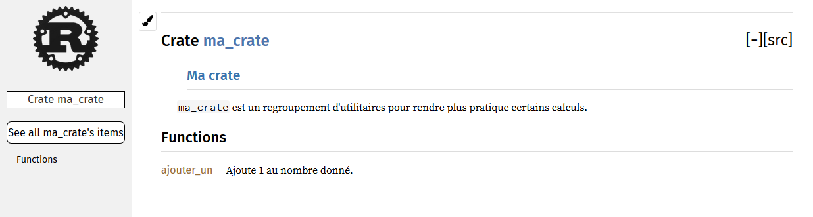

<!--
## Publishing a Crate to Crates.io
-->

## Publier une crate sur crates.io

<!--
We’ve used packages from [crates.io](https://crates.io/)<!-- ignore -- > as
dependencies of our project, but you can also share your code with other people
by publishing your own packages. The crate registry at
[crates.io](https://crates.io/)<!-- ignore -- > distributes the source code of
your packages, so it primarily hosts code that is open source.
-->

Nous avons déjà utilisé des paquets provenant de
[crates.io](https://crates.io/)<!-- ignore --> comme dépendance de notre projet,
mais vous pouvez aussi partager votre code avec d'autres personnes en publiant
vos propres paquets. Le registre des crates disponible sur
[crates.io](https://crates.io/)<!-- ignore --> distribue le code source de vos
paquets, donc il héberge principalement du code qui est open source.

<!--
Rust and Cargo have features that help make your published package easier for
people to use and to find in the first place. We’ll talk about some of these
features next and then explain how to publish a package.
-->

Rust et cargo ont des fonctionnalités qui aident les développeurs à trouver et
utiliser les paquets que vous publiez. Nous allons voir certaines de ces
fonctionnalités puis nous allons expliquer comment publier un paquet.

<!--
### Making Useful Documentation Comments
-->

### Créer des commentaires de documentation utiles

<!--
Accurately documenting your packages will help other users know how and when to
use them, so it’s worth investing the time to write documentation. In Chapter
3, we discussed how to comment Rust code using two slashes, `//`. Rust also has
a particular kind of comment for documentation, known conveniently as a
*documentation comment*, that will generate HTML documentation. The HTML
displays the contents of documentation comments for public API items intended
for programmers interested in knowing how to *use* your crate as opposed to how
your crate is *implemented*.
-->

Documenter correctement vos paquets aidera les autres utilisateurs à savoir
comment et quand les utiliser, donc ça vaut la peine de consacrer du temps à la
rédaction de la documentation. Dans le chapitre 3, nous avons vu comment
commenter du code Rust en utilisant deux barres obliques `//`. Rust a aussi un
type particulier de commentaire pour la documentation, aussi connu sous le nom
de *commentaire de documentation*, qui va générer de la documentation en HTML.
Le HTML affiche le contenu des commentaires de documentation pour les éléments
public de votre API à destination des développeurs qui s'intéressent à la
manière *d'utiliser* votre crate et non pas à la manière dont elle est
*implémentée*.

<!--
Documentation comments use three slashes, `///`, instead of two and support
Markdown notation for formatting the text. Place documentation comments just
before the item they’re documenting. Listing 14-1 shows documentation comments
for an `add_one` function in a crate named `my_crate`:
-->

Les commentaires de documentation utilisent trois barres obliques `///` au lieu
de deux et prend en charge la notation Markdown pour mettre en forme le texte.
Placez les commentaires de documentation juste avant l'élément qu'ils
documentent. L'encart 14-1 montre des commentaires de documentation pour une
fonction `ajouter_un` dans une crate nommée `ma_crate` :

<!--
<span class="filename">Filename: src/lib.rs</span>
-->

<span class="filename">Fichier : src/lib.rs</span>

<!--
```rust,ignore
{{#rustdoc_include ../listings-sources/ch14-more-about-cargo/listing-14-01/src/lib.rs}}
```
-->

```rust,ignore
{{#rustdoc_include ../listings/ch14-more-about-cargo/listing-14-01/src/lib.rs}}
```

<!--
<span class="caption">Listing 14-1: A documentation comment for a
function</span>
-->

<span class="caption">Encart 14-1 : un commentaire de documentation pour une
fonction</span>

<!--
Here, we give a description of what the `add_one` function does, start a
section with the heading `Examples`, and then provide code that demonstrates
how to use the `add_one` function. We can generate the HTML documentation from
this documentation comment by running `cargo doc`. This command runs the
`rustdoc` tool distributed with Rust and puts the generated HTML documentation
in the *target/doc* directory.
-->

Ici nous avons écrit une description de ce que fait la fonction `ajouter_un`,
débuté une section avec le titre `Exemples`, et ensuite on a fourni du code qui
montre comment utiliser la fonction `ajouter_un`. Nous pouvons générer la
documentation HTML de ces commentaires de documentation en lançant `cargo doc`.
Cette commande lance l'outil `rustdoc` qui est distribué avec Rust et place la
documentation HTML générée dans le dossier *target/doc*.

<!--
For convenience, running `cargo doc --open` will build the HTML for your
current crate’s documentation (as well as the documentation for all of your
crate’s dependencies) and open the result in a web browser. Navigate to the
`add_one` function and you’ll see how the text in the documentation comments is
rendered, as shown in Figure 14-1:
-->

Pour plus de facilité, lancer `cargo doc --open` va générer le HTML pour la
documentation de votre crate courante (ainsi que la documentation pour toutes
les dépendances de la crate) et ouvrir le résultat dans un navigateur web.
Rendez-vous à la fonction `ajouter_one` et vous découvrirez comment le texte
dans les commentaires de la documentation a été interprété, qui devrait
ressembler à l'illustration 14-1 :

<!-- markdownlint-disable -->
<!--

-->
<!-- markdownlint-restore -->


<!--
<span class="caption">Figure 14-1: HTML documentation for the `add_one`
function</span>
-->

<span class="caption">Illustration 14-1 : documentation HTML pour la fonction
`ajouter_un`</span>

<!--
#### Commonly Used Sections
-->

#### Les sections utilisées fréquemment

<!--
We used the `# Examples` Markdown heading in Listing 14-1 to create a section
in the HTML with the title “Examples.” Here are some other sections that crate
authors commonly use in their documentation:
-->

Nous avons utilisé le titre en Markdown `# Exemples` dans l'encart 14-1 afin de
créer une section dans le HTML avec le titre “Exemples”. Voici d'autres sections
que les auteurs de crate utilisent fréquemment dans leur documentation :

<!--
* **Panics**: The scenarios in which the function being documented could
  panic. Callers of the function who don’t want their programs to panic should
  make sure they don’t call the function in these situations.
* **Errors**: If the function returns a `Result`, describing the kinds of
  errors that might occur and what conditions might cause those errors to be
  returned can be helpful to callers so they can write code to handle the
  different kinds of errors in different ways.
* **Safety**: If the function is `unsafe` to call (we discuss unsafety in
  Chapter 19), there should be a section explaining why the function is unsafe
  and covering the invariants that the function expects callers to uphold.
-->

* **Panics** : le scénario dans lequel la fonction est documentée peut paniquer.
  Ceux qui utilisent la fonction et qui ne veulent pas que leur programme
  panique doivent s'assurer qu'ils n'appellent pas la fonction dans ce genre de
  situation.
* **Errors** : si la fonction retourne un `Result`, documenter les types
  d'erreurs qui peuvent survenir ainsi que les conditions qui mènent à ces
  erreurs sera très bénéfique pour ceux qui utilisent votre API afin qu'ils
  puissent écrire du code pour gérer ces différents types d'erreurs de manière à
  ce que cela leur convienne.
* **Safety** : si la fonction fait un appel à `unsafe` (que nous verrons au
  chapitre 19), il devrait exister une section qui explique pourquoi la fonction
  fait appel à *unsafe* et quels sont les paramètres que la fonction s'attend à
  recevoir des utilisateurs de l'API.

<!--
Most documentation comments don’t need all of these sections, but this is a
good checklist to remind you of the aspects of your code that people calling
your code will be interested in knowing about.
-->

La plupart des commentaires sur la documentation n'ont pas besoin de ces
sections, mais c'est une bonne liste de vérifications à avoir pour vous rappeler
les éléments importants à signaler aux utilisateurs.

<!--
#### Documentation Comments as Tests
-->

#### Les commentaires de documentation pour faire des tests

<!--
Adding example code blocks in your documentation comments can help demonstrate
how to use your library, and doing so has an additional bonus: running `cargo
test` will run the code examples in your documentation as tests! Nothing is
better than documentation with examples. But nothing is worse than examples
that don’t work because the code has changed since the documentation was
written. If we run `cargo test` with the documentation for the `add_one`
function from Listing 14-1, we will see a section in the test results like this:
-->

L'ajout des blocs de code d'exemple dans vos commentaires de documentation
peuvent vous aider à montrer comment utiliser votre bibliothèque, et faire ceci
apporte un bonus supplémentaire : l'exécution de `cargo test` va lancer les
codes d'exemples présents dans votre documentation comme étant des tests ! Il
n'y a rien de mieux que de la documentation avec des exemples. Mais il n'y a
rien de pire que des exemples qui ne fonctionnent plus car le code a changé
depuis que la documentation a été écrite. Si nous lançons `cargo test` avec la
documentation de la fonction `ajouter_un` de l'encart 14-1, nous verrons une
section dans les résultats de tests comme celle-ci :

<!--
<!-- manual-regeneration
cd listings/ch14-more-about-cargo/listing-14-01/
cargo test
copy just the doc-tests section below
-- >
-->

<!--
```text
   Doc-tests my_crate

running 1 test
test src/lib.rs - add_one (line 5) ... ok

test result: ok. 1 passed; 0 failed; 0 ignored; 0 measured; 0 filtered out; finished in 0.27s
```
-->

```text
   Doc-tests ma_crate

running 1 test
test src/lib.rs - ajouter_un (line 5) ... ok

test result: ok. 1 passed; 0 failed; 0 ignored; 0 measured; 0 filtered out; finished in 0.27s
```

<!--
Now if we change either the function or the example so the `assert_eq!` in the
example panics and run `cargo test` again, we’ll see that the doc tests catch
that the example and the code are out of sync with each other!
-->

Maintenant, si nous changeons la fonction ou l'exemple de sorte que le
`assert_eq!` fasse paniquer l'exemple et que nous lançons `cargo test` à
nouveau, nous verrons que les tests de documentation vont découvrir que
l'exemple et le code sont désynchronisés l'un de l'autre !

<!--
#### Commenting Contained Items
-->

#### Commenter l'élément qui contient l'élément courant

<!--
Another style of doc comment, `//!`, adds documentation to the item that
contains the comments rather than adding documentation to the items following
the comments. We typically use these doc comments inside the crate root file
(*src/lib.rs* by convention) or inside a module to document the crate or the
module as a whole.
-->

Un autre style de commentaire de documentation, `//!`, ajoute de la
documentation à l'élément qui contient ce commentaire plutôt que d'ajouter la
documentation à l'élément qui suit ce commentaire. Nous utilisons
habituellement ces commentaires de documentation dans le fichier de la crate
racine (qui est *src/lib.rs* par convention) ou à l'intérieur d'un module afin
de documenter la crate ou le module dans son ensemble.

<!--
For example, if we want to add documentation that describes the purpose of the
`my_crate` crate that contains the `add_one` function, we can add documentation
comments that start with `//!` to the beginning of the *src/lib.rs* file, as
shown in Listing 14-2:
-->

Par exemple, si nous souhaitons ajouter de la documentation qui décrit le rôle
de la crate `ma_crate` qui contient la fonction `ajouter_un`, nous pouvons
ajouter des commentaires de documentation qui commencent par `//!` au début du
fichier *src/lib.rs*, comme dans l'encart 14-2 :

<!--
<span class="filename">Filename: src/lib.rs</span>
-->

<span class="filename">Fichier : src/lib.rs</span>

<!--
```rust,ignore
{{#rustdoc_include ../listings-sources/ch14-more-about-cargo/listing-14-02/src/lib.rs:here}}
```
-->

```rust,ignore
{{#rustdoc_include ../listings/ch14-more-about-cargo/listing-14-02/src/lib.rs:here}}
```

<!--
<span class="caption">Listing 14-2: Documentation for the `my_crate` crate as a
whole</span>
-->

<span class="caption">Encart 14-2 : documentation portant sur la crate
`ma_crate`</span>

<!--
Notice there isn’t any code after the last line that begins with `//!`. Because
we started the comments with `//!` instead of `///`, we’re documenting the item
that contains this comment rather than an item that follows this comment. In
this case, the item that contains this comment is the *src/lib.rs* file, which
is the crate root. These comments describe the entire crate.
-->

Remarquez qu'il n'y a pas de code après la dernière ligne qui commence par
`//!`. Comme nous commençons les commentaires par `//!` au lieu de `///`, nous
documentons l'élément qui contient ce commentaire plutôt que l'élément qui suit
ce commentaire. Dans notre cas, l'élément qui contient ce commentaire est le
fichier *src/lib.rs*, qui est la racine de la crate. Ces commentaires vont
décrire l'intégralité de la crate.

<!--
When we run `cargo doc --open`, these comments will display on the front
page of the documentation for `my_crate` above the list of public items in the
crate, as shown in Figure 14-2:
-->

Lorsque nous lançons `cargo doc --open`, ces commentaires vont s'afficher sur la
page d'accueil de la documentation de `ma_crate`, au-dessus de la liste des
éléments publics de la crate, comme montré dans l'illustration 14-2 :

<!-- markdownlint-disable -->
<!--

-->
<!-- markdownlint-restore -->


<!--
<span class="caption">Figure 14-2: Rendered documentation for `my_crate`,
including the comment describing the crate as a whole</span>
-->

<span class="caption">Illustration 14-2 : Documentation générée pour `ma_crate`,
qui contient le commentaire qui décrit l'intégralité de la crate</span>

<!--
Documentation comments within items are useful for describing crates and
modules especially. Use them to explain the overall purpose of the container to
help your users understand the crate’s organization.
-->

Les commentaires de la documentation placés à l'intérieur des éléments sont
particulièrement utiles pour décrire les crates et les modules. Utilisez-les
pour expliquer globalement le rôle du conteneur pour aider vos utilisateurs à
comprendre l'organisation de votre crate.

<!--
### Exporting a Convenient Public API with `pub use`
-->

### Exporter une API publique conviviale avec `pub use`

<!--
In Chapter 7, we covered how to organize our code into modules using the `mod`
keyword, how to make items public using the `pub` keyword, and how to bring
items into a scope with the `use` keyword. However, the structure that makes
sense to you while you’re developing a crate might not be very convenient for
your users. You might want to organize your structs in a hierarchy containing
multiple levels, but then people who want to use a type you’ve defined deep in
the hierarchy might have trouble finding out that type exists. They might also
be annoyed at having to enter `use`
`my_crate::some_module::another_module::UsefulType;` rather than `use`
`my_crate::UsefulType;`.
-->

Dans le chapitre 7, nous avons vu comment organiser notre code en modules en
utilisant le mot-clé `mod`, comment faire pour rendre des éléments publics en
utilisant le mot-clé `pub`, et comment importer des éléments dans la portée en
utilisant le mot-clé `use`. Cependant, la structure qui a un sens pour vous
pendant que vous développez une crate peut ne pas être pratique pour vos
utilisateurs. Vous pourriez vouloir organiser vos structures dans une hiérarchie
qui a plusieurs niveaux, mais les personnes qui veulent utiliser un type que
vous avez défini dans un niveau profond de la hiérarchie pourraient rencontrer
des difficultés pour savoir que ce type existe. Ils peuvent aussi être agacés
d'avoir à écrire `use ma_crate::un_module::un_autre_module::TypeUtile;` plutôt
que `use ma_crate::TypeUtile;`.

<!--
The structure of your public API is a major consideration when publishing a
crate. People who use your crate are less familiar with the structure than you
are and might have difficulty finding the pieces they want to use if your crate
has a large module hierarchy.
-->

La structure de votre API publique est une question importante lorsque vous
publiez une crate. Les personnes qui utilisent votre crate sont moins familiers
avec la structure que vous l'êtes et pourraient avoir des difficultés à trouver
les éléments qu'ils souhaitent utiliser si votre crate a une hiérarchie de
module imposante.

<!--
The good news is that if the structure *isn’t* convenient for others to use
from another library, you don’t have to rearrange your internal organization:
instead, you can re-export items to make a public structure that’s different
from your private structure by using `pub use`. Re-exporting takes a public
item in one location and makes it public in another location, as if it were
defined in the other location instead.
-->

La bonne nouvelle est que si la structure *n'est pas* pratique pour ceux qui
l'utilisent dans une autre bibliothèque, vous n'avez pas à réorganiser votre
organisation interne : à la place, vous pouvez ré-exporter les éléments pour
créer une structure publique qui est différente de votre structure privée en
utilisant `pub use`. Ré-exporter prend un élément public d'un endroit et le
rend public dans un autre endroit, comme s'il était défini dans l'autre endroit.

<!--
For example, say we made a library named `art` for modeling artistic concepts.
Within this library are two modules: a `kinds` module containing two enums
named `PrimaryColor` and `SecondaryColor` and a `utils` module containing a
function named `mix`, as shown in Listing 14-3:
-->

Par exemple, disons que nous avons créé une bibliothèque `art` pour modéliser
des concepts artistiques. A l'intérieur de cette bibliothèque nous avons deux
modules : un module `types` qui contient deux énumérations `CouleurPrimaire` et
`CouleurSecondaire`, et un module `utilitaires` qui contient une fonction
`mixer`, comme dans l'encart 14-3 :

<!--
<span class="filename">Filename: src/lib.rs</span>
-->

<span class="filename">Fichier : src/lib.rs</span>

<!--
```rust,noplayground,test_harness
{{#rustdoc_include ../listings-sources/ch14-more-about-cargo/listing-14-03/src/lib.rs:here}}
```
-->

```rust,noplayground,test_harness
{{#rustdoc_include ../listings/ch14-more-about-cargo/listing-14-03/src/lib.rs:here}}
```

<!--
<span class="caption">Listing 14-3: An `art` library with items organized into
`kinds` and `utils` modules</span>
-->

<span class="caption">Encart 14-3 : une bibliothèque `art` avec des éléments
organisés selon les modules `types` et `utilitaires`</span>

<!--
Figure 14-3 shows what the front page of the documentation for this crate
generated by `cargo doc` would look like:
-->

L'illustration 14-3 montre la page d'accueil de la documentation de cette crate
générée par `cargo doc` qui devrait ressembler à cela :

<!-- markdownlint-disable -->
<!--

-->


<!-- markdownlint-restore -->

<!--
<span class="caption">Figure 14-3: Front page of the documentation for `art`
that lists the `kinds` and `utils` modules</span>
-->

<span class="caption">Illustration 14-3 : Page d'accueil de la documentation de
`art` qui liste les modules `types` et `utilitaires`</span>

<!--
Note that the `PrimaryColor` and `SecondaryColor` types aren’t listed on the
front page, nor is the `mix` function. We have to click `kinds` and `utils` to
see them.
-->

Notez que les types `CouleurPrimaire` et `CouleurSecondaire` ne sont pas listés
sur la page d'accueil, ni la fonction `mixer`. Nous devons cliquer sur `types`
et `utilitaires` pour les voir.

<!--
Another crate that depends on this library would need `use` statements that
bring the items from `art` into scope, specifying the module structure that’s
currently defined. Listing 14-4 shows an example of a crate that uses the
`PrimaryColor` and `mix` items from the `art` crate:
-->

Une autre crate qui dépend de cette bibliothèque va avoir besoin d'utiliser
l'instruction `use` pour importer les éléments de `art` dans sa portée, en
suivant la structure du module qui est actuellement définie. L'encart 14-4
montre un exemple d'une crate qui utilise les éléments `CouleurPrimaire` et
`mixer` de la crate `art` :

<!--
<span class="filename">Filename: src/main.rs</span>
-->

<span class="filename">Fichier : src/main.rs</span>

<!--
```rust,ignore
{{#rustdoc_include ../listings-sources/ch14-more-about-cargo/listing-14-04/src/main.rs}}
```
-->

```rust,ignore
{{#rustdoc_include ../listings/ch14-more-about-cargo/listing-14-04/src/main.rs}}
```

<!--
<span class="caption">Listing 14-4: A crate using the `art` crate’s items with
its internal structure exported</span>
-->

<span class="caption">Encart 14-4 : une crate qui utilise les éléments de la
crate `art` avec sa structure interne exportée</span>

<!--
The author of the code in Listing 14-4, which uses the `art` crate, had to
figure out that `PrimaryColor` is in the `kinds` module and `mix` is in the
`utils` module. The module structure of the `art` crate is more relevant to
developers working on the `art` crate than to developers using the `art` crate.
The internal structure that organizes parts of the crate into the `kinds`
module and the `utils` module doesn’t contain any useful information for
someone trying to understand how to use the `art` crate. Instead, the `art`
crate’s module structure causes confusion because developers have to figure out
where to look, and the structure is inconvenient because developers must
specify the module names in the `use` statements.
-->

L'auteur du code de l'encart 14-4, qui utilise la crate `art`, doit comprendre
que `CouleurPrimaire` est dans le module `types` et que `mixer` est dans le
module `utilitaires`. La structure du module de la crate `art` est bien plus
pratique pour les développeurs qui travaillent sur la crate `art` que pour les
développeurs qui utilisent la crate `art`. La structure interne qui divise les
éléments de la crate dans le module `types` et le module `utilitaires` ne
contient aucune information utile à quelqu'un qui essaye de comprendre comment
utiliser la crate `art`. Au lieu de cela, la structure du module de la crate
`art` génère de la confusion car les développeurs doivent découvrir où trouver
les éléments, et la structure n'est pas pratique car les développeurs doivent
renseigner les noms des modules dans les instructions `use`.

<!--
To remove the internal organization from the public API, we can modify the
`art` crate code in Listing 14-3 to add `pub use` statements to re-export the
items at the top level, as shown in Listing 14-5:
-->

Pour masquer l'organisation interne de l'API publique, nous pouvons modifier le
code de la crate `art` de l'encart 14-3 pour ajouter l'instruction `pub use`
pour ré-exporter les éléments au niveau supérieur, comme montré dans l'encart
14-5 :

<!--
<span class="filename">Filename: src/lib.rs</span>
-->

<span class="filename">Fichier : src/lib.rs</span>

<!--
```rust,ignore
{{#rustdoc_include ../listings-sources/ch14-more-about-cargo/listing-14-05/src/lib.rs:here}}
```
-->

```rust,ignore
{{#rustdoc_include ../listings/ch14-more-about-cargo/listing-14-05/src/lib.rs:here}}
```

<!--
<span class="caption">Listing 14-5: Adding `pub use` statements to re-export
items</span>
-->

<span class="caption">Encart 14-5 : ajout de l'instruction `pub use` pour
ré-exporter les éléments</span>

<!--
The API documentation that `cargo doc` generates for this crate will now list
and link re-exports on the front page, as shown in Figure 14-4, making the
`PrimaryColor` and `SecondaryColor` types and the `mix` function easier to find.
-->

La documentation de l'API que `cargo doc` a généré pour cette crate va
maintenant lister et lier les ré-exportations sur la page d'accueil, comme dans
l'illustration 14-4, ce qui rend les types `CouleurPrimaire` et
`CouleurSecondaire` plus faciles à trouver.

<!-- markdownlint-disable -->
<!--

-->


<!-- markdownlint-restore -->

<!--
<span class="caption">Figure 14-4: The front page of the documentation for `art`
that lists the re-exports</span>
-->

<span class="caption">Illustration 14-4 : la page d'accueil de la documentation
pour `art` qui liste les ré-exports</span>

<!--
The `art` crate users can still see and use the internal structure from Listing
14-3 as demonstrated in Listing 14-4, or they can use the more convenient
structure in Listing 14-5, as shown in Listing 14-6:
-->

Les utilisateurs de la crate `art` peuvent toujours voir et utiliser la
structure interne de l'encart 14-3 comme ils l'utilisaient dans l'encart 14-4,
mais ils peuvent maintenant utiliser la structure plus pratique de l'encart
14-5, comme montré dans l'encart 14-6 :

<!--
<span class="filename">Filename: src/main.rs</span>
-->

<span class="filename">Fichier : src/main.rs</span>

<!--
```rust,ignore
{{#rustdoc_include ../listings-sources/ch14-more-about-cargo/listing-14-06/src/main.rs:here}}
```
-->

```rust,ignore
{{#rustdoc_include ../listings/ch14-more-about-cargo/listing-14-06/src/main.rs:here}}
```

<!--
<span class="caption">Listing 14-6: A program using the re-exported items from
the `art` crate</span>
-->

<span class="caption">Encart 14-6 : un programme qui utilise les éléments
ré-exportés de la crate `art`</span>

<!--
In cases where there are many nested modules, re-exporting the types at the top
level with `pub use` can make a significant difference in the experience of
people who use the crate.
-->

Dans les cas où il y a de nombreux modules imbriqués, ré-exporter les types au
niveau le plus haut avec `pub use` peut faire une différence significative dans
l'expérience utilisateur de ceux qui utilisent cette crate.

<!--
Creating a useful public API structure is more of an art than a science, and
you can iterate to find the API that works best for your users. Choosing `pub
use` gives you flexibility in how you structure your crate internally and
decouples that internal structure from what you present to your users. Look at
some of the code of crates you’ve installed to see if their internal structure
differs from their public API.
-->

Créer une structure d'API publique utile est plus un art qu'une science, et vous
pouvez itérer plusieurs fois pour trouver une API qui fonctionne mieux pour vos
utilisateurs. Choisir `pub use` vous donne de la flexibilité pour l'organisation
interne de votre crate et découple la structure interne de ce que vous présentez
aux utilisateurs. N'hésitez pas à regarder le code source des crates que vous
avez installé pour voir si leur structure interne est différente de leur API
publique.

<!--
### Setting Up a Crates.io Account
-->

### Mise en place d'un compte crates.io

<!--
Before you can publish any crates, you need to create an account on
[crates.io](https://crates.io/)<!-- ignore -- > and get an API token. To do so,
visit the home page at [crates.io](https://crates.io/)<!-- ignore -- > and log in
via a GitHub account. (The GitHub account is currently a requirement, but the
site might support other ways of creating an account in the future.) Once
you’re logged in, visit your account settings at
[https://crates.io/me/](https://crates.io/me/)<!-- ignore -- > and retrieve your
API key. Then run the `cargo login` command with your API key, like this:
-->

Avant de pouvoir publier une crate, vous devez créer un compte sur
[crates.io](https://crates.io/)<!-- ignore --> et obtenir un jeton d'API. Pour
pouvoir faire cela, visitez la page d'accueil de
[crates.io](https://crates.io/)<!-- ignore --> et connectez-vous avec votre
compte GitHub (le compte GitHub est actuellement une obligation, mais crates.io
pourra permettre de créer un compte d'une autre manière un jour). Une fois
identifié, visitez les réglages de votre compte à l'adresse
[https://crates.io/me/](https://crates.io/me/)<!-- ignore --> et récupérez votre
jeton d'API (NdT : *API key*). Ensuite, lancez la commande `cargo login` avec
votre clé d'API, comme ceci :

<!--
```console
$ cargo login abcdefghijklmnopqrstuvwxyz012345
```
-->

```console
$ cargo login abcdefghijklmnopqrstuvwxyz012345
```

<!--
This command will inform Cargo of your API token and store it locally in
*~/.cargo/credentials*. Note that this token is a *secret*: do not share it
with anyone else. If you do share it with anyone for any reason, you should
revoke it and generate a new token on [crates.io](https://crates.io/)<!-- ignore
-- >.
-->

Cette commande informera cargo de votre jeton d'API et l'enregistrera localement
dans *~/.cargo/credentials*. Notez que ce jeton est un *secret* : ne le partagez
avec personne d'autre. Si vous le donnez à quelqu'un pour une quelconque raison,
vous devriez la révoquer et générer un nouveau jeton sur
[crates.io](https://crates.io/)<!-- ignore -->.

<!--
### Adding Metadata to a New Crate
-->

### Ajouter des métadonnées à une nouvelle crate

<!--
Now that you have an account, let’s say you have a crate you want to publish.
Before publishing, you’ll need to add some metadata to your crate by adding it
to the `[package]` section of the crate’s *Cargo.toml* file.
-->

Maintenant que vous avez un compte, imaginons que vous avez une crate que vous
souhaitez publier. Avant de la publier, vous aurez besoin d'ajouter quelques
métadonnées à votre crate en les ajoutant à la section `[package]` du fichier
*Cargo.toml* de votre crate.

<!--
Your crate will need a unique name. While you’re working on a crate locally,
you can name a crate whatever you’d like. However, crate names on
[crates.io](https://crates.io/)<!-- ignore -- > are allocated on a first-come,
first-served basis. Once a crate name is taken, no one else can publish a crate
with that name. Before attempting to publish a crate, search for the name you
want to use on the site. If the name has been used by another crate, you will
need to find another name and edit the `name` field in the *Cargo.toml* file
under the `[package]` section to use the new name for publishing, like so:
-->

Votre crate va avoir besoin d'un nom unique. Tant que vous travaillez en local,
vous pouvez nommer un crate comme vous le souhaitez. Cependant, les noms des
crates sur [crates.io](https://crates.io/)<!-- ignore --> sont accordés selon le
principe du *premier arrivé, premier servi*. Une fois qu'un nom de crate est
accordé, personne d'autre ne peut publier une crate avec ce nom. Avant d'essayer
de publier une crate, recherchez sur le site le nom que vous souhaitez utiliser.
Si le nom a été utilisé par une autre crate, vous allez devoir trouver un autre
nom et modifier le champ `name` dans le fichier *Cargo.toml* sous la section
`[package]` pour utiliser le nouveau nom pour la publication, comme ceci :

<!--
<span class="filename">Filename: Cargo.toml</span>
-->

<span class="filename">Fichier : Cargo.toml</span>

<!--
```toml
[package]
name = "guessing_game"
```
-->

```toml
[package]
name = "jeu_du_plus_ou_du_moins"
```

<!--
Even if you’ve chosen a unique name, when you run `cargo publish` to publish
the crate at this point, you’ll get a warning and then an error:
-->

Même si vous avez choisi un nom unique, lorsque vous lancez `cargo publish` pour
publier la crate à ce stade, vous allez avoir un avertissement suivi par une
erreur :

<!--
<!-- manual-regeneration
cd listings/ch14-more-about-cargo/listing-14-01/
cargo publish
copy just the relevant lines below
-- >
-->

<!--
```console
$ cargo publish
    Updating crates.io index
warning: manifest has no description, license, license-file, documentation, homepage or repository.
See https://doc.rust-lang.org/cargo/reference/manifest.html#package-metadata for more info.
--snip--
error: api errors (status 200 OK): missing or empty metadata fields: description, license. Please see https://doc.rust-lang.org/cargo/reference/manifest.html for how to upload metadata
```
-->

```console
$ cargo publish
    Updating crates.io index
warning: manifest has no description, license, license-file, documentation, homepage or repository.
See https://doc.rust-lang.org/cargo/reference/manifest.html#package-metadata for more info.
-- partie masquée ici --
error: api errors (status 200 OK): missing or empty metadata fields: description, license. Please see https://doc.rust-lang.org/cargo/reference/manifest.html for how to upload metadata
```

<!--
The reason is that you’re missing some crucial information: a description and
license are required so people will know what your crate does and under what
terms they can use it. To rectify this error, you need to include this
information in the *Cargo.toml* file.
-->

La raison est qu'il manque quelques informations essentielles : une description
et une licence sont nécessaires pour que les gens puissent savoir ce que fait
votre crate et sous quelles conditions ils peuvent l'utiliser. Pour corriger
cette erreur, vous devez rajouter ces informations dans le fichier *Cargo.toml*.

<!--
Add a description that is just a sentence or two, because it will appear with
your crate in search results. For the `license` field, you need to give a
*license identifier value*. The [Linux Foundation’s Software Package Data
Exchange (SPDX)][spdx] lists the identifiers you can use for this value. For
example, to specify that you’ve licensed your crate using the MIT License, add
the `MIT` identifier:
-->

Ajoutez une description qui ne fait qu'une phrase ou deux, car elle va
s'afficher à proximité de votre crate dans les résultats de recherche. Pour le
champ `license`, vous devez donner une *valeur d'identification de la licence*.
La [Linux Foundation’s Software Package Data Exchange (SPDX)][spdx] liste les
identifications que vous pouvez utiliser pour cette valeur. Par exemple, pour
renseigner que votre crate est sous la licence MIT, ajoutez l'identifiant
`MIT` :

<!--
[spdx]: http://spdx.org/licenses/
-->

[spdx]: http://spdx.org/licenses/

<!--
<span class="filename">Filename: Cargo.toml</span>
-->

<span class="filename">Fichier : Cargo.toml</span>

<!--
```toml
[package]
name = "guessing_game"
license = "MIT"
```
-->

```toml
[package]
name = "jeu_du_plus_ou_du_moins"
license = "MIT"
```

<!--
If you want to use a license that doesn’t appear in the SPDX, you need to place
the text of that license in a file, include the file in your project, and then
use `license-file` to specify the name of that file instead of using the
`license` key.
-->

Si vous voulez utiliser une licence qui n'apparaît pas dans le SPDX, vous devez
placer le texte de cette licence dans un fichier, inclure ce fichier dans votre
projet, et ensuite utiliser `licence-file` pour renseigner le nom de ce fichier
plutôt que d'utiliser la clé `licence`.

<!--
Guidance on which license is appropriate for your project is beyond the scope
of this book. Many people in the Rust community license their projects in the
same way as Rust by using a dual license of `MIT OR Apache-2.0`. This practice
demonstrates that you can also specify multiple license identifiers separated
by `OR` to have multiple licenses for your project.
-->

Les conseils sur le choix de la licence appropriée pour votre projet sortent du
cadre de ce livre. De nombreuses personnes dans la communauté Rust appliquent à
leurs projets la même licence que Rust qui utilise la licence double
`MIT OR Apache-2.0`. Cette pratique montre que vous pouvez également indiquer
plusieurs identificateurs de licence séparés par `OR` pour avoir plusieurs
licences pour votre projet.

<!--
With a unique name, the version, your description, and a license added, the
*Cargo.toml* file for a project that is ready to publish might look like this:
-->

Avec le nom unique, la version, la description et la licence que vous avez
ajouté, le fichier *Cargo.toml* de ce projet qui est prêt à être publié devrait
ressembler à ceci :

<!--
<span class="filename">Filename: Cargo.toml</span>
-->

<span class="filename">Fichier : Cargo.toml</span>

<!--
```toml
[package]
name = "guessing_game"
version = "0.1.0"
edition = "2018"
description = "A fun game where you guess what number the computer has chosen."
license = "MIT OR Apache-2.0"

[dependencies]
```
-->

```toml
[package]
name = "jeu_du_plus_ou_du_moins"
version = "0.1.0"
edition = "2018"
description = "Un jeu où vous devez deviner quel nombre l'ordinateur a choisi."
license = "MIT OR Apache-2.0"

[dependencies]
```

<!--
[Cargo’s documentation](https://doc.rust-lang.org/cargo/) describes other
metadata you can specify to ensure others can discover and use your crate more
easily.
-->

La [documentation de cargo](https://doc.rust-lang.org/cargo/) décris d'autres
métadonnées que vous pouvez renseigner pour vous assurer que les autres
développeurs puissent découvrir encore plus facilement votre crate.

<!--
### Publishing to Crates.io
-->

### Publier sur crates.io

<!--
Now that you’ve created an account, saved your API token, chosen a name for
your crate, and specified the required metadata, you’re ready to publish!
Publishing a crate uploads a specific version to
[crates.io](https://crates.io/)<!-- ignore -- > for others to use.
-->

Maintenant que vous avez créé un compte, sauvegardé votre jeton de clé, choisi
un nom pour votre crate, et précisé les métadonnées requises, vous êtes prêt à
publier ! Publier une crate téléverse une version précise sur
[crates.io](https://crates.io/)<!-- ignore --> pour que les autres puissent
l'utiliser.

<!--
Be careful when publishing a crate because a publish is *permanent*. The
version can never be overwritten, and the code cannot be deleted. One major
goal of [crates.io](https://crates.io/)<!-- ignore -- > is to act as a permanent
archive of code so that builds of all projects that depend on crates from
[crates.io](https://crates.io/)<!-- ignore -- > will continue to work. Allowing
version deletions would make fulfilling that goal impossible. However, there is
no limit to the number of crate versions you can publish.
-->

Faites attention lorsque vous publiez une crate car une publication est
*permanente*. La version ne pourra jamais être remplacée, et le code ne pourra
jamais être effacé. Le but majeur de
[crates.io](https://crates.io/)<!-- ignore --> est de fournir une archive
durable de code afin que les compilations de tous les projets qui dépendent des
crates de [crates.io](https://crates.io/)<!-- ignore --> puissent toujours
continuer à fonctionner. Si la suppression de version était autorisée, cela
rendrait ce but impossible. Cependant, il n'y a pas de limites au nombre de
versions de votre crate que vous pouvez publier.

<!--
Run the `cargo publish` command again. It should succeed now:
-->

Lancez la commande `cargo publish` à nouveau. Elle devrait fonctionner à
présent :

<!--
<!-- manual-regeneration
go to some valid crate, publish a new version
cargo publish
copy just the relevant lines below
-- >
-->

<!--
```console
$ cargo publish
    Updating crates.io index
   Packaging guessing_game v0.1.0 (file:///projects/guessing_game)
   Verifying guessing_game v0.1.0 (file:///projects/guessing_game)
   Compiling guessing_game v0.1.0
(file:///projects/guessing_game/target/package/guessing_game-0.1.0)
    Finished dev [unoptimized + debuginfo] target(s) in 0.19s
   Uploading guessing_game v0.1.0 (file:///projects/guessing_game)
```
-->

```console
$ cargo publish
    Updating crates.io index
   Packaging jeu_du_plus_ou_du_moins v0.1.0 (file:///projects/jeu_du_plus_ou_du_moins)
   Verifying jeu_du_plus_ou_du_moins v0.1.0 (file:///projects/jeu_du_plus_ou_du_moins)
   Compiling jeu_du_plus_ou_du_moins v0.1.0
(file:///projects/jeu_du_plus_ou_du_moins/target/package/jeu_du_plus_ou_du_moins-0.1.0)
    Finished dev [unoptimized + debuginfo] target(s) in 0.19s
   Uploading jeu_du_plus_ou_du_moins v0.1.0 (file:///projects/jeu_du_plus_ou_du_moins)
```

<!--
Congratulations! You’ve now shared your code with the Rust community, and
anyone can easily add your crate as a dependency of their project.
-->

Félicitations ! Vous venez de partager votre code avec la communauté Rust, et
désormais tout le monde peut facilement ajouter votre crate comme une dépendance
de leur projet.

<!--
### Publishing a New Version of an Existing Crate
-->

### Publier une nouvelle version d'une crate existante

<!--
When you’ve made changes to your crate and are ready to release a new version,
you change the `version` value specified in your *Cargo.toml* file and
republish. Use the [Semantic Versioning rules][semver] to decide what an
appropriate next version number is based on the kinds of changes you’ve made.
Then run `cargo publish` to upload the new version.
-->

Lorsque vous avez fait des changements sur votre crate et que vous êtes prêt à
publier une nouvelle version, vous devez changer la valeur de `version`
renseignée dans votre fichier *Cargo.toml* et le publier à nouveau. Utilisez les
[règles versionnage sémantique][semver] pour choisir quelle sera la prochaine
version la plus appropriée en fonction des changements que vous avez fait.
Lancez ensuite `cargo publish` pour téléverser la nouvelle version.

<!--
[semver]: http://semver.org/
-->

[semver]: https://semver.org/lang/fr/

<!--
### Removing Versions from Crates.io with `cargo yank`
-->

### Retirer des versions de crates.io avec `cargo yank`

<!--
Although you can’t remove previous versions of a crate, you can prevent any
future projects from adding them as a new dependency. This is useful when a
crate version is broken for one reason or another. In such situations, Cargo
supports *yanking* a crate version.
-->

Bien que vous ne puissiez pas enlever des versions précédentes d'une crate, vous
pouvez prévenir les futurs projets de ne pas l'ajouter comme une nouvelle
dépendance. Cela s'avère pratique lorsqu'une version de crate est défectueuse
pour une raison ou une autre. Dans de telles circonstances, cargo permet de
*déprécier* une version de crate.

<!--
Yanking a version prevents new projects from starting to depend on that version
while allowing all existing projects that depend on it to continue to download
and depend on that version. Essentially, a yank means that all projects with a
*Cargo.lock* will not break, and any future *Cargo.lock* files generated will
not use the yanked version.
-->

Déprécier une version évite que les nouveaux projets ajoutent une dépendance à
cette version tout en permettant à tous les projets existants de continuer à en
dépendre en leur permettant toujours de télécharger et dépendre de cette
version. En gros, une version dépréciée permet à tous les projets avec un
*Cargo.lock* de ne pas échouer, mais tous les futurs fichiers *Cargo.lock*
générés n'utiliseront pas la version dépréciée.

<!--
To yank a version of a crate, run `cargo yank` and specify which version you
want to yank:
-->

Pour déprécier une version d'une crate, lancez `cargo yank` et renseignez quelle
version vous voulez déprécier :

<!--
```console
$ cargo yank --vers 1.0.1
```
-->

```console
$ cargo yank --vers 1.0.1
```

<!--
By adding `--undo` to the command, you can also undo a yank and allow projects
to start depending on a version again:
-->

Si vous ajoutez `--undo` à la commande, vous pouvez aussi annuler une
dépréciation et permettre à nouveaux aux projets de dépendre de cette version :

<!--
```console
$ cargo yank --vers 1.0.1 --undo
```
-->

```console
$ cargo yank --vers 1.0.1 --undo
```

<!--
A yank *does not* delete any code. For example, the yank feature is not
intended for deleting accidentally uploaded secrets. If that happens, you must
reset those secrets immediately.
-->

Une dépréciation *ne supprime pas* du code. Par exemple, la fonctionnalité de
dépréciation n'est pas conçue pour supprimer des *secrets* téléversés par
mégarde. Si cela arrive, vous devriez régénérer immédiatement ces secrets.
