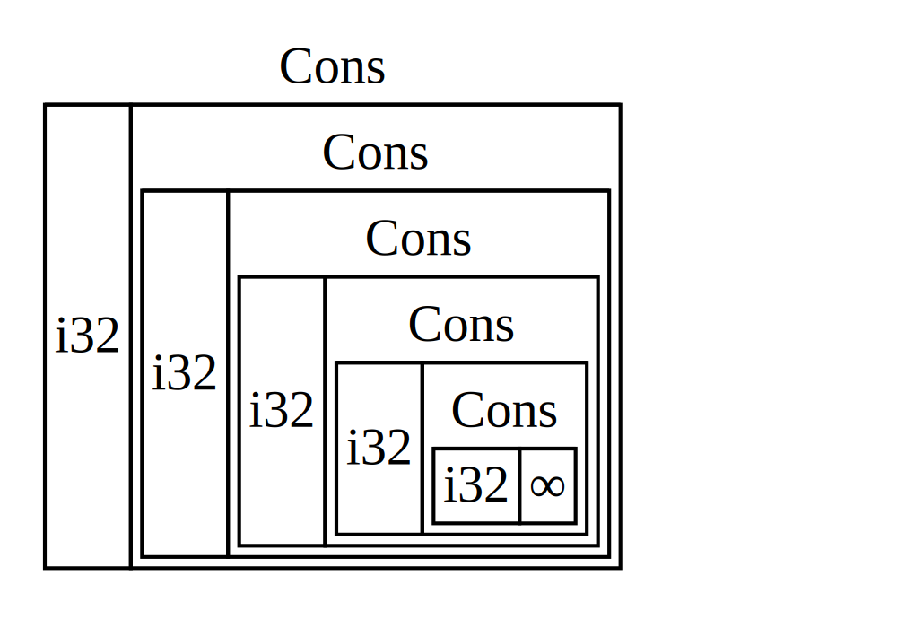
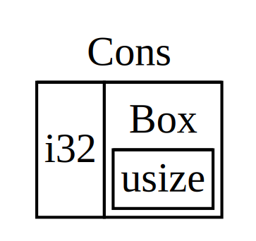

<!--
## Using `Box<T>` to Point to Data on the Heap
-->

## Utiliser `Box<T>` pour pointer sur des données présentes sur le tas

<!--
The most straightforward smart pointer is a *box*, whose type is written
`Box<T>`. Boxes allow you to store data on the heap rather than the stack. What
remains on the stack is the pointer to the heap data. Refer to Chapter 4 to
review the difference between the stack and the heap.
-->

Le pointeur intelligent le plus simple est la *boite*, dont le type s'écrit
`Box<T>`. Les boites vous permettent de stocker des données sur le tas plutôt
que sur la pile. La seule chose qui reste sur la pile est le pointeur vers les
données sur le tas. Revenez au chapitre 4 pour vous rappeler la différence entre
la pile et le tas.

<!--
Boxes don’t have performance overhead, other than storing their data on the
heap instead of on the stack. But they don’t have many extra capabilities
either. You’ll use them most often in these situations:
-->

Les boites ne provoquent pas de surcharge au niveau des performances, si ce
n'est le stockage de leurs données sur le tas plutôt que sur la pile. Mais elles
n'ont pas non plus beaucoup plus de fonctionnalités. Vous allez les utiliser
principalement dans les situations suivantes :

<!--
* When you have a type whose size can’t be known at compile time and you want
  to use a value of that type in a context that requires an exact size
* When you have a large amount of data and you want to transfer ownership but
  ensure the data won’t be copied when you do so
* When you want to own a value and you care only that it’s a type that
  implements a particular trait rather than being of a specific type
-->

* Lorsque vous avez un type dont la taille ne peut pas être connu au moment de
  la compilation et que vous souhaitez une valeur d'un certain type dans un
  contexte qui nécessite de savoir exactement sa taille
* Lorsque vous avez une grosse quantité de données et que vous souhaitez
  transférer la possession tout en assurant que les données ne seront pas
  copiées lorsque vous le ferez
* Lorsque vous voulez prendre possession d'une valeur et que vous souhaitez
  seulement qu'elle soit d'un type qui implémente un trait particulier plutôt
  que d'être d'un type spécique

<!--
We’ll demonstrate the first situation in the [“Enabling Recursive Types with
Boxes”](#enabling-recursive-types-with-boxes)<!-- ignore -- > section. In the
second case, transferring ownership of a large amount of data can take a long
time because the data is copied around on the stack. To improve performance in
this situation, we can store the large amount of data on the heap in a box.
Then, only the small amount of pointer data is copied around on the stack,
while the data it references stays in one place on the heap. The third case is
known as a *trait object*, and Chapter 17 devotes an entire section, [“Using
Trait Objects That Allow for Values of Different Types,”][trait-objects]<!--
ignore -- > just to that topic. So what you learn here you’ll apply again in
Chapter 17!
-->

Nous allons expérimenter la première situation dans la section [“Pouvoir
utiliser des types récursifs grâce aux
boites”](#pouvoir-utiliser-des-types-récursifs-grâce-aux-boites)<!-- ignore -->.
Pour la seconde situation, le transfert de possession d'une grosse quantité de
données peut prendre beaucoup de temps car les données sont recopiées sur la
pile. Pour améliorer les performances dans cette situation, nous pouvons stocker
ces données sur le tas grâce à une boite. Ainsi, seul le petit pointeur vers les
données est copié sur la pile, alors que les données qu'il pointe restent à leur
place sur le tas. La troisième situation décris ce qu'on appelle un
*objet de trait* et le [chapitre 17][trait-objects]<!-- ignore --> dédie une
section entière à ce sujet. Donc ce que vous apprenez ici, vous le retrouverez à
nouveau au chapitre 17 !

<!--
### Using a `Box<T>` to Store Data on the Heap
-->

### Utiliser une `Box<T>` pour stocker des données sur le tas

<!--
Before we discuss this use case for `Box<T>`, we’ll cover the syntax and how to
interact with values stored within a `Box<T>`.
-->

Avant de parler de ce cas d'usage de `Box<T>`, nous devons voir sa syntaxe et
comment interagir avec les valeurs stockées dans un `Box<T>`.

<!--
Listing 15-1 shows how to use a box to store an `i32` value on the heap:
-->

L'encart 15-1 nous montre comment utiliser une boite pour stocker une valeur
`i32` sur le tas :

<!--
<span class="filename">Filename: src/main.rs</span>
-->

<span class="filename">Fichier : src/main.rs</span>

<!--
```rust
{{#rustdoc_include ../listings-sources/ch15-smart-pointers/listing-15-01/src/main.rs}}
```
-->

```rust
{{#rustdoc_include ../listings/ch15-smart-pointers/listing-15-01/src/main.rs}}
```

<!--
<span class="caption">Listing 15-1: Storing an `i32` value on the heap using a
box</span>
-->

<span class="caption">Encart 15-1 : stocker une valeur `i32` sur le tas en
utilisant une boîte</span>

<!--
We define the variable `b` to have the value of a `Box` that points to the
value `5`, which is allocated on the heap. This program will print `b = 5`; in
this case, we can access the data in the box similar to how we would if this
data were on the stack. Just like any owned value, when a box goes out of
scope, as `b` does at the end of `main`, it will be deallocated. The
deallocation happens for the box (stored on the stack) and the data it points
to (stored on the heap).
-->

Nous avons défini la variable `b` pour avoir la valeur d'une `Box` qui pointe
sur la valeur `5`, qui est donc allouée sur le tas. Ce programme va afficher
`b = 5` ; dans ce cas, nous pouvons accéder à la donnée présente dans la boite
de la même manière que nous le ferrions si elle était sur la pile. Comme toute
valeur possédée, lorsque une boite sort de la portée, comme lorsque `b` le fait
à la fin du `main`, elle sera désallouée. Ce sera la boite qui sera désallouée
en premier (elle est stockée sur la pile), puis ce sera au tour des données sur
lesquelles elle pointait (qui sont stockées sur le tas).

<!--
Putting a single value on the heap isn’t very useful, so you won’t use boxes by
themselves in this way very often. Having values like a single `i32` on the
stack, where they’re stored by default, is more appropriate in the majority of
situations. Let’s look at a case where boxes allow us to define types that we
wouldn’t be allowed to if we didn’t have boxes.
-->

Déposer une seule valeur sur le tas n'est pas très utile, donc vous n'utiliserez
que très rarement les boites de cette manière. Laisser les valeurs comme des `i32`
indépendantes sur la pile, où elles sont stockées par défaut, reste plus
approprié dans la majeure partie des situations. Regardons un cas où les boites
nous permettent de définir des types que nous ne pourrions pas définir si nous
n'avions pas les boites.

<!--
### Enabling Recursive Types with Boxes
-->

### Pouvoir utiliser des types récursifs grâce aux boites

<!--
At compile time, Rust needs to know how much space a type takes up. One type
whose size can’t be known at compile time is a *recursive type*, where a value
can have as part of itself another value of the same type. Because this nesting
of values could theoretically continue infinitely, Rust doesn’t know how much
space a value of a recursive type needs. However, boxes have a known size, so
by inserting a box in a recursive type definition, you can have recursive types.
-->

Au moment de la compilation, Rust a besoin de savoir combien d'espace prend un
type. Un des types dont la taille ne peut pas être connu au moment de la
compilation est le *type récursif*, dans lequel une valeur peut avoir une partie
de sa définition qui a une valeur du même type qu'elle-même. Comme cet emboîtement
de valeurs pourrait théoriquement se poursuivre à l'infini, Rust ne sait pas
combien d'espace une valeur d'un type récursif peut avoir besoin. Cependant, les
boites ont une taille connue, donc en utilisant une boite dans la définition
d'un type récursif, vous pouvez créer des types récursifs.

<!--
Let’s explore the *cons list*, which is a data type common in functional
programming languages, as an example of a recursive type. The cons list type
we’ll define is straightforward except for the recursion; therefore, the
concepts in the example we’ll work with will be useful any time you get into
more complex situations involving recursive types.
-->

Découvrons maintenant la *liste de construction* (NdT : cons list), qui est un
type de donnée courant dans les langages de programmation fonctionnels, comme
étant un exemple de type récursif. Le type liste de construction que nous allons
définir est plutôt simple, sauf pour les cas de récursivité ; par conséquent,
les concepts dans l'exemple avec lequel nous allons travailler vous seront
utiles à chaque fois que vous vous retrouverez dans des situations plus
complexes qui impliquent des types récursifs.

<!--
#### More Information About the Cons List
-->

#### En savoir plus sur les listes de construction

<!--
A *cons list* is a data structure that comes from the Lisp programming language
and its dialects. In Lisp, the `cons` function (short for “construct function”)
constructs a new pair from its two arguments, which usually are a single value
and another pair. These pairs containing pairs form a list.
-->

Une *liste de construction* est une structure de donnée qui provient du langage
de programmation Lisp et de ses dérivés. En Lisp, la fonction `cons` (qui est
une forme contractée de “fonction de construction”) construit une nouvelle paire
à partir de ses deux arguments, qui sont souvent une valeur individuelle et une
autre paire. Ces paires qui contiennent des paires forment des listes.

<!--
The cons function concept has made its way into more general functional
programming jargon: “to cons *x* onto *y*” informally means to construct a new
container instance by putting the element *x* at the start of this new
container, followed by the container *y*.
-->

Le concept de la fonction cons a fait son chemin dans le jargon plus général de
la programmation fonctionnelle : "to cons *x* onto *y*" signifie de manière
informelle de construire une nouvelle instance de conteneur en mettant l'élément
*x* au début de ce nouveau conteneur, suivi du conteneur *y*.

<!--
Each item in a cons list contains two elements: the value of the current item
and the next item. The last item in the list contains only a value called `Nil`
without a next item. A cons list is produced by recursively calling the `cons`
function. The canonical name to denote the base case of the recursion is `Nil`.
Note that this is not the same as the “null” or “nil” concept in Chapter 6,
which is an invalid or absent value.
-->

Chaque élément dans une liste de construction contient deux éléments : la valeur
de l'élément courant et celle de l'élément suivant. Le dernier élément dans la
liste contient seulement une valeur `Nil` sans aucun élément suivant. Une
liste de construction est produite de manière récursive en appelant la fonction
`cons`. Le nom canonique pour indiquer le cas de base de la récursion est `Nil`.
Notez que ce n'est pas la même chose que les concepts “null” ou “nil” du
chapitre 6, qui signale une valeur invalide ou absente.

<!--
Although functional programming languages use cons lists frequently, the cons
list isn’t a commonly used data structure in Rust. Most of the time when you
have a list of items in Rust, `Vec<T>` is a better choice to use. Other, more
complex recursive data types *are* useful in various situations, but by
starting with the cons list, we can explore how boxes let us define a recursive
data type without much distraction.
-->

Bien que les langages de programmation fonctionnels utilisent les listes de
construction fréquemment, la liste de construction n'est pas une structure de
donnée utilisée couramment en Rust. La plupart du temps lorsque vous avez une
liste d'éléments en Rust, `Vec<T>` s'avère être un meilleur choix à faire.
Autrement, il existe des types de données récursifs plus complexes *qui sont*
utiles dans d'autres situations, mais en commençant avec les listes de
construction, nous pouvons découvrir comment les boites nous permettent de
définir un type de données récursif sans être trop perturbé par la complexité.

<!--
Listing 15-2 contains an enum definition for a cons list. Note that this code
won’t compile yet because the `List` type doesn’t have a known size, which
we’ll demonstrate.
-->

L'encart 15-2 propose une définition d'une énumération pour une liste de
construction. Notez que ce code ne se compile pas encore car le type `List` n'a
pas encore de taille connue, ce que nous allons voir ensuite.

<!--
<span class="filename">Filename: src/main.rs</span>
-->

<span class="filename">Fichier : src/main.rs</span>

<!--
```rust,ignore,does_not_compile
{{#rustdoc_include ../listings-sources/ch15-smart-pointers/listing-15-02/src/main.rs:here}}
```
-->

```rust,ignore,does_not_compile
{{#rustdoc_include ../listings/ch15-smart-pointers/listing-15-02/src/main.rs:here}}
```

<!--
<span class="caption">Listing 15-2: The first attempt at defining an enum to
represent a cons list data structure of `i32` values</span>
-->

<span class="caption">Encart 15-2 : première tentative de définition d'une
énumération pour représenter une structure de données de liste de construction
de valeurs `i32`</span>

<!--
> Note: We’re implementing a cons list that holds only `i32` values for the
> purposes of this example. We could have implemented it using generics, as we
> discussed in Chapter 10, to define a cons list type that could store values of
> any type.
-->

> Remarque : nous implémentons une liste de construction qui stocke uniquement
> des valeurs `i32` pour les besoins de cet exemple. Nous aurions pu
> l'implémenter en utilisant des génériques, que nous avons vu chapitre 10, afin
> de définir une liste de construction qui pourrait stocker n'importe quel type.

<!--
Using the `List` type to store the list `1, 2, 3` would look like the code in
Listing 15-3:
-->

L'utilisation du type `List` pour stocker la liste `1, 2, 3` ressemblerait au
code dans l'encart 15-3 :

<!--
<span class="filename">Filename: src/main.rs</span>
-->

<span class="filename">Fichier : src/main.rs</span>

<!--
```rust,ignore,does_not_compile
{{#rustdoc_include ../listings-sources/ch15-smart-pointers/listing-15-03/src/main.rs:here}}
```
-->

```rust,ignore,does_not_compile
{{#rustdoc_include ../listings/ch15-smart-pointers/listing-15-03/src/main.rs:here}}
```

<!--
<span class="caption">Listing 15-3: Using the `List` enum to store the list `1,
2, 3`</span>
-->

<span class="caption">Encart 15-3 : utilisation de l'énumération `List` pour
stocker la liste `1, 2, 3`</span>

<!--
The first `Cons` value holds `1` and another `List` value. This `List` value is
another `Cons` value that holds `2` and another `List` value. This `List` value
is one more `Cons` value that holds `3` and a `List` value, which is finally
`Nil`, the non-recursive variant that signals the end of the list.
-->

La première valeur `Cons` stocke `1` et une autre valeur de `List`. Cette
valeur `List` est une autre valeur `Cons` qui stocke `2` et une autre valeur de
`List`. Cette valeur `List` n'est rien d'autre qu'une valeur `Cons` qui stocke
`3` et une valeur `List`, qui finalement est `Nil`, la variante non récursive
qui signale la fin de la liste.

<!--
If we try to compile the code in Listing 15-3, we get the error shown in
Listing 15-4:
-->

Si nous essayons de compiler le code de l'encart 15-3, nous avons l'erreur de
l'encart 15-4 :

<!--
```console
{{#include ../listings-sources/ch15-smart-pointers/listing-15-03/output.txt}}
```
-->

```console
{{#include ../listings/ch15-smart-pointers/listing-15-03/output.txt}}
```

<!--
<span class="caption">Listing 15-4: The error we get when attempting to define
a recursive enum</span>
-->

<span class="caption">Encart 15-4 : l'erreur que nous obtenons lorsque nous
essayons de définir une énumération récursive</span>

<!--
The error shows this type “has infinite size.” The reason is that we’ve defined
`List` with a variant that is recursive: it holds another value of itself
directly. As a result, Rust can’t figure out how much space it needs to store a
`List` value. Let’s break down why we get this error a bit. First, let’s look
at how Rust decides how much space it needs to store a value of a non-recursive
type.
-->

L'erreur explique que ce type “a une taille infinie”. La raison est que nous
avons défini `List` avec une variante qui est récursive : elle stocke
directement une autre valeur d'elle-même. Au final, Rust ne peut pas savoir
combien de place il a besoin pour stocker une valeur `List`. Analysons
pourquoi nous obtenons cette erreur. D'abord, regardons comment Rust décide de
l'espace dont il a besoin pour stocker une valeur d'un type non récursif.

<!--
#### Computing the Size of a Non-Recursive Type
-->

#### Calculer la taille d'un type non récursif

<!--
Recall the `Message` enum we defined in Listing 6-2 when we discussed enum
definitions in Chapter 6:
-->

Rappelez-vous de l'énumération `Message` que nous avons défini dans
l'encart 6-2 lorsque nous avons abordé les définitions des énumérations au
chapitre 6 :

<!--
```rust
{{#rustdoc_include ../listings-sources/ch06-enums-and-pattern-matching/listing-06-02/src/main.rs:here}}
```
-->

```rust
{{#rustdoc_include ../listings/ch06-enums-and-pattern-matching/listing-06-02/src/main.rs:here}}
```

<!--
To determine how much space to allocate for a `Message` value, Rust goes
through each of the variants to see which variant needs the most space. Rust
sees that `Message::Quit` doesn’t need any space, `Message::Move` needs enough
space to store two `i32` values, and so forth. Because only one variant will be
used, the most space a `Message` value will need is the space it would take to
store the largest of its variants.
-->

Pour déterminer combien d'espace allouer pour une valeur `Message`, Rust
parcourt chaque variante pour voir quelle variante a besoin le plus d'espace.
Rust voit que `Message::Quit` n'a pas besoin d'espace, `Message::Move` a besoin
de suffisamment d'espace pour stocker deux valeurs `i32`, et ainsi de suite.
Comme une seule variante sera utilisée, le plus grand espace dont une valeur
de `Message` aura besoin sera l'espace que cela prendra de stocker la plus
grosse de ses variantes.

<!--
Contrast this with what happens when Rust tries to determine how much space a
recursive type like the `List` enum in Listing 15-2 needs. The compiler starts
by looking at the `Cons` variant, which holds a value of type `i32` and a value
of type `List`. Therefore, `Cons` needs an amount of space equal to the size of
an `i32` plus the size of a `List`. To figure out how much memory the `List`
type needs, the compiler looks at the variants, starting with the `Cons`
variant. The `Cons` variant holds a value of type `i32` and a value of type
`List`, and this process continues infinitely, as shown in Figure 15-1.
-->

Comparez cela avec ce qui se passe lorsque Rust essaye de déterminer combien
d'espace un type récursif comme l'énumération `List` de l'encart 15-2 aurait
besoin. Le compilateur commence par regarder la variante `Cons`, qui stocke une
valeur de type `i32` et une valeur de type `List`. Ainsi, `Cons` a besoin d'une
quantité d'espace égale à la taille d'un `i32` plus la taille d'une valeur
`List`. Pour savoir combien de mémoire le type `List` a besoin, le compilateur
va regarder ses variantes, en commençant avec la variante `Cons`. La variante
`Cons` stocke une valeur de type `i32` et une valeur de type `List`, et ce
processus continue à l'infini, comme l'illustration 15-1.

<!-- markdownlint-disable -->
<!--

-->
<!-- markdownlint-restore -->


<!--
<span class="caption">Figure 15-1: An infinite `List` consisting of infinite
`Cons` variants</span>
-->

<span class="caption">Illustration 15-1 : une `List` infinie qui contient des
variantes `Cons` infinies</span>

<!--
#### Using `Box<T>` to Get a Recursive Type with a Known Size
-->

#### Utiliser `Box<T>` pour créer un type récursif avec une taille finie

<!--
Rust can’t figure out how much space to allocate for recursively defined types,
so the compiler gives the error in Listing 15-4. But the error does include
this helpful suggestion:
-->

Rust ne peut pas calculer la quantité d'espace à allouer pour les types
définis récursivement, donc le compilateur déclenche l'erreur de l'encart
15-4. Mais l'erreur renferme cette suggestion très utile :

<!--
<!-- manual-regeneration
after doing automatic regeneration, look at listings/ch15-smart-pointers/listing-15-03/output.txt and copy the relevant line
-- >
-->

<!--
```text
  = help: insert indirection (e.g., a `Box`, `Rc`, or `&`) at some point to make `List` representable
```
-->

```text
  = help: insert indirection (e.g., a `Box`, `Rc`, or `&`) at some point to make `List` representable
```

<!--
In this suggestion, “indirection” means that instead of storing a value
directly, we’ll change the data structure to store the value indirectly by
storing a pointer to the value instead.
-->

Dans cette suggestion, “indirection” (NdT : redirection) signifie qu'au lieu de
stocker une valeur directement, nous devrions changer la structure des données
pour stocker à la place un pointeur vers la valeur.

<!--
Because a `Box<T>` is a pointer, Rust always knows how much space a `Box<T>`
needs: a pointer’s size doesn’t change based on the amount of data it’s
pointing to. This means we can put a `Box<T>` inside the `Cons` variant instead
of another `List` value directly. The `Box<T>` will point to the next `List`
value that will be on the heap rather than inside the `Cons` variant.
Conceptually, we still have a list, created with lists “holding” other lists,
but this implementation is now more like placing the items next to one another
rather than inside one another.
-->

Comme `Box<T>` est un pointeur, Rust connaît toujours combien d'espace un
`Box<T>` a besoin : la taille d'un pointeur ne change pas, peu importe la
quantité de données sur lesquelles il pointe. Cela signifie que nous pouvons
insérer un `Box<T>` à l'intérieur d'une variante `Cons` au lieu d'y mettre
directement une autre valeur `List`. Le `Box<T>` va pointer sur la prochaine
valeur `List` qui sera sur le tas plutôt que d'être dans la variante `Cons`.
Théoriquement, nous avons toujours une liste, créée avec des listes qui
“contiennent” d'autres listes, mais cette implémentation est ressemble plus
maintenant à des éléments placés les uns à côté des autres, plutôt que les
uns dans les autres.

<!--
We can change the definition of the `List` enum in Listing 15-2 and the usage
of the `List` in Listing 15-3 to the code in Listing 15-5, which will compile:
-->

Nous pouvons changer la définition de l'énumération `List` de l'encart 15-2 et
l'utilisation de `List` dans l'encart 15-3 pour le code de l'encart 15-5, qui
va se compiler :

<!--
<span class="filename">Filename: src/main.rs</span>
-->

<span class="filename">Filename : src/main.rs</span>

<!--
```rust
{{#rustdoc_include ../listings-sources/ch15-smart-pointers/listing-15-05/src/main.rs}}
```
-->

```rust
{{#rustdoc_include ../listings/ch15-smart-pointers/listing-15-05/src/main.rs}}
```

<!--
<span class="caption">Listing 15-5: Definition of `List` that uses `Box<T>` in
order to have a known size</span>
-->

<span class="caption">Encart 15-5 : définition de `List` qui utilise `Box<T>`
dans le but d'avoir une taille connue</span>

<!--
The `Cons` variant will need the size of an `i32` plus the space to store the
box’s pointer data. The `Nil` variant stores no values, so it needs less space
than the `Cons` variant. We now know that any `List` value will take up the
size of an `i32` plus the size of a box’s pointer data. By using a box, we’ve
broken the infinite, recursive chain, so the compiler can figure out the size
it needs to store a `List` value. Figure 15-2 shows what the `Cons` variant
looks like now.
-->

La variante `Cons` va avoir besoin de l'espace d'un `i32` plus l'espace pour
stocker le pointeur vers la donnée de la boite. La variante `Nil` ne stocke pas
de valeurs, donc elle a besoin de moins d'espace que la variante `Cons`. Nous
savons maintenant que chaque valeur `List` va prendre la taille d'un `i32`
plus la taille d'un pointeur vers la donnée de la boite. En utilisant une boite,
vous avez arrêté la chaine infinie et récursive, donc le compilateur peut
savoir l'espace dont il a besoin pour stocker une valeur `List`. L'illustration
15-2 montre à quoi ressemble maintenant la variante `Cons`.

<!--

-->


<!--
<span class="caption">Figure 15-2: A `List` that is not infinitely sized
because `Cons` holds a `Box`</span>
-->

<span class="caption">Illustration 15-2 : une `List` qui n'a pas de taille
infinie car `Cons` est une `Box`</span>

<!--
Boxes provide only the indirection and heap allocation; they don’t have any
other special capabilities, like those we’ll see with the other smart pointer
types. They also don’t have any performance overhead that these special
capabilities incur, so they can be useful in cases like the cons list where the
indirection is the only feature we need. We’ll look at more use cases for boxes
in Chapter 17, too.
-->

Les boites fournissent uniquement la redirection et l'allocation sur le tas ;
elles n'ont pas d'autres fonctionnalités, comme celles que nous verrons sur
d'autres types de pointeurs intelligents. Elles n'ont pas non plus de surcoût
sur les performances autre que ce qu'offrent ces capacités spéciales, donc
elles sont utiles dans des cas comme les listes de construction où la
redirection est la seule fonctionnalité que nous avons besoin. Nous verrons
aussi plus de cas d'usages pour les boites dans le chapitre 17.

<!--
The `Box<T>` type is a smart pointer because it implements the `Deref` trait,
which allows `Box<T>` values to be treated like references. When a `Box<T>`
value goes out of scope, the heap data that the box is pointing to is cleaned
up as well because of the `Drop` trait implementation. Let’s explore these two
traits in more detail. These two traits will be even more important to the
functionality provided by the other smart pointer types we’ll discuss in the
rest of this chapter.
-->

Le type `Box<T>` est un pointeur intelligent car il implémente le trait
`Deref`, qui permet aux valeurs `Box<T>` d'être traitées comme des
références. Lorsque une valeur `Box<T>` sort de la portée, les données sur le
tas que la boite pointait est aussi nettoyé grâce au trait `Drop`. Explorons
plus en détail ces deux traits. Ces deux traits deviendrons encore plus
importants pour les fonctionnalités offertes par les autres pointeurs
intelligents que nous verrons dans le reste de ce chapitre.

<!-- markdownlint-disable -->
<!--
[trait-objects]: ch17-02-trait-objects.html#using-trait-objects-that-allow-for-values-of-different-types
-->
<!-- markdownlint-restore -->

[trait-objects]: ch17-02-trait-objects.html
