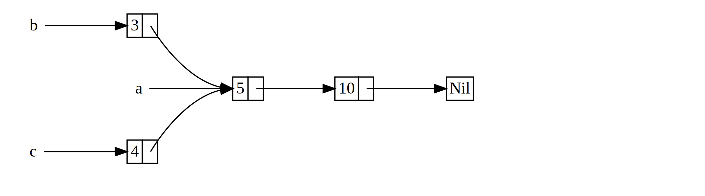

<!--
## `Rc<T>`, the Reference Counted Smart Pointer
-->

## `Rc<T>`, le pointeur intelligent qui compte les références

<!--
In the majority of cases, ownership is clear: you know exactly which variable
owns a given value. However, there are cases when a single value might have
multiple owners. For example, in graph data structures, multiple edges might
point to the same node, and that node is conceptually owned by all of the edges
that point to it. A node shouldn’t be cleaned up unless it doesn’t have any
edges pointing to it.
-->

Dans la majorité des cas, la possession est claire : vous savez exactement
quelle variable possède une valeur donnée. Cependant, il existe des cas où une
valeur peut être possédée par plusieurs propriétaires. Par exemple, dans des
structures de données de graphes, plusieurs extrémités peuvent pointer vers le
même noeud, et ce noeud est par conception possédé par toutes les extrémités qui
pointent vers lui. Un noeud ne devrait pas être nettoyé, à moins qu'il n'ait plus
d'extrémités qui pointent vers lui.

<!--
To enable multiple ownership, Rust has a type called `Rc<T>`, which is an
abbreviation for *reference counting*. The `Rc<T>` type keeps track of the
number of references to a value to determine whether or not the value is still
in use. If there are zero references to a value, the value can be cleaned up
without any references becoming invalid.
-->

Pour permettre la possession multiple, Rust dispose du type `Rc<T>`, qui est une
abréviation pour `Reference Counting` *(compteur de références)*. Le type
`Rc<T>` assure le suivi du nombre de références vers une valeur, afin de
déterminer si la valeur est toujours utilisée ou non. S'il y a zéro références
vers une valeur, la valeur peut être nettoyée sans qu'aucune référence ne devienne
invalide.

<!--
Imagine `Rc<T>` as a TV in a family room. When one person enters to watch TV,
they turn it on. Others can come into the room and watch the TV. When the last
person leaves the room, they turn off the TV because it’s no longer being used.
If someone turns off the TV while others are still watching it, there would be
uproar from the remaining TV watchers!
-->

Imaginez que `Rc<T>` est comme une télévision dans une salle commune. Lorsqu'une
personne entre pour regarder la télévision, elle l'allume. Une autre entre dans
la salle et regarde la télévision. Lorsque la dernière personne quitte la salle,
elle éteint la télévision car elle n'est plus utilisée. Si quelqu'un éteint la
télévision alors que d'autres continuent à la regarder, cela va provoquer du
chahut !

<!--
We use the `Rc<T>` type when we want to allocate some data on the heap for
multiple parts of our program to read and we can’t determine at compile time
which part will finish using the data last. If we knew which part would finish
last, we could just make that part the data’s owner, and the normal ownership
rules enforced at compile time would take effect.
-->

Nous utilisons le type `Rc<T>` lorsque nous souhaitons allouer une donnée sur
le tas pour que plusieurs éléments de notre programme puissent la lire et que
nous ne pouvons pas déterminer au moment de la compilation quel élément cessera
de l'utiliser en dernier. Si nous savions quel élément finirait en dernier,
nous pourrions simplement faire en sorte que cet élément prenne possession de
la donnée, et les règles de possession classiques qui s'appliquent au moment de
la compilation prendraient effet.

<!--
Note that `Rc<T>` is only for use in single-threaded scenarios. When we discuss
concurrency in Chapter 16, we’ll cover how to do reference counting in
multithreaded programs.
-->

Notez que `Rc<T>` fonctionne uniquement dans des scénarios à un seul processus.
Lorsque nous verrons la concurrence au chapitre 16, nous verrons comment
procéder au comptage de références dans des programmes multi-processus.

<!--
### Using `Rc<T>` to Share Data
-->

### Utiliser `Rc<T>` pour partager une donnée

<!--
Let’s return to our cons list example in Listing 15-5. Recall that we defined
it using `Box<T>`. This time, we’ll create two lists that both share ownership
of a third list. Conceptually, this looks similar to Figure 15-3:
-->

Retournons à notre exemple de liste de construction de l'encart 15-5.
Souvenez-vous que nous l'avons défini en utilisant `Box<T>`. Cette fois-ci, nous
allons créer deux listes qui partagent toutes les deux la propriété d'une
troisième liste. Théoriquement, cela ressemblera à l'illustration 15-3 :

<!-- markdownlint-disable -->
<!--

-->
<!-- markdownlint-restore -->


<!--
<span class="caption">Figure 15-3: Two lists, `b` and `c`, sharing ownership of
a third list, `a`</span>
-->

<span class="caption">Illustration 15-3 : deux listes, `b` et `c`, qui se
partagent la possession d'une troisième liste, `a`</span>

<!--
We’ll create list `a` that contains 5 and then 10. Then we’ll make two more
lists: `b` that starts with 3 and `c` that starts with 4. Both `b` and `c`
lists will then continue on to the first `a` list containing 5 and 10. In other
words, both lists will share the first list containing 5 and 10.
-->

Nous allons créer une liste `a` qui contient `5` et ensuite `10`. Ensuite, nous
allons créer deux autres listes : `b` qui démarre avec `3` et `c` qui démarre
avec `4`. Les deux listes `b` et `c` vont ensuite continuer sur la première
liste `a` qui contient déjà `5` et `10`. Autrement dit, les deux listes vont se
partager la première liste contenant `5` et `10`.

<!--
Trying to implement this scenario using our definition of `List` with `Box<T>`
won’t work, as shown in Listing 15-17:
-->

Si nous essayons d'implémenter ce scénario en utilisant les définitions de
`List` avec `Box<T>`, comme dans l'encart 15-17, cela ne va pas fonctionner :

<!--
<span class="filename">Filename: src/main.rs</span>
-->

<span class="filename">Fichier : src/main.rs</span>

<!--
```rust,ignore,does_not_compile
{{#rustdoc_include ../listings-sources/ch15-smart-pointers/listing-15-17/src/main.rs}}
```
-->

```rust,ignore,does_not_compile
{{#rustdoc_include ../listings/ch15-smart-pointers/listing-15-17/src/main.rs}}
```

<!--
<span class="caption">Listing 15-17: Demonstrating we’re not allowed to have
two lists using `Box<T>` that try to share ownership of a third list</span>
-->

<span class="caption">Encart 15-17 : démonstration que nous ne sommes pas
autorisés à avoir deux listes qui utilisent `Box<T>` pour partager la propriété
d'une troisième liste</span>

<!--
When we compile this code, we get this error:
-->

Lorsque nous compilons ce code, nous obtenons cette erreur :

<!--
```console
{{#include ../listings-sources/ch15-smart-pointers/listing-15-17/output.txt}}
```
-->

```console
{{#include ../listings/ch15-smart-pointers/listing-15-17/output.txt}}
```

<!--
The `Cons` variants own the data they hold, so when we create the `b` list, `a`
is moved into `b` and `b` owns `a`. Then, when we try to use `a` again when
creating `c`, we’re not allowed to because `a` has been moved.
-->

Les variantes `Cons` prennent possession des données qu'elles obtiennent, donc
lorsque nous avons créé la liste `b`, `a` a été déplacée dans `b` et `b` possède
désormais `a`. Ensuite, lorsque nous essayons d'utiliser `a` à nouveau lorsque
nous créons `c`, nous ne sommes pas autorisés à le faire car `a` a été déplacé.

<!--
We could change the definition of `Cons` to hold references instead, but then
we would have to specify lifetime parameters. By specifying lifetime
parameters, we would be specifying that every element in the list will live at
least as long as the entire list. The borrow checker wouldn’t let us compile
`let a = Cons(10, &Nil);` for example, because the temporary `Nil` value would
be dropped before `a` could take a reference to it.
-->

Nous pourrions changer la définition de `Cons` pour stocker des références à la
place, mais ensuite nous aurions besoin de renseigner des paramètres de durée de
vie. En renseignant les paramètres de durée de vie, nous devrions préciser que chaque
élément dans la liste vivra au moins aussi longtemps que la liste entière. Le
vérificateur d'emprunt ne nous laisserait pas compiler `let a = Cons(10, &Nil);`
par exemple, car la valeur temporaire `Nil` serait libérée avant que `a` ne puisse
obtenir une référence vers elle.

<!--
Instead, we’ll change our definition of `List` to use `Rc<T>` in place of
`Box<T>`, as shown in Listing 15-18. Each `Cons` variant will now hold a value
and an `Rc<T>` pointing to a `List`. When we create `b`, instead of taking
ownership of `a`, we’ll clone the `Rc<List>` that `a` is holding, thereby
increasing the number of references from one to two and letting `a` and `b`
share ownership of the data in that `Rc<List>`. We’ll also clone `a` when
creating `c`, increasing the number of references from two to three. Every time
we call `Rc::clone`, the reference count to the data within the `Rc<List>` will
increase, and the data won’t be cleaned up unless there are zero references to
it.
-->

A la place, nous allons changer la définition de `List` pour utiliser `Rc<T>` à
la place de `Box<T>`, comme dans l'encart 15-18. Chaque variante `Cons` va
maintenant posséder une valeur et un `Rc<T>` pointant sur une `List`. Lorsque
nous créons `b`, au lieu de prendre possession de `a`, nous allons cloner le
`Rc<List>` que `a` possède, augmentant ainsi le nombre de références de un à
deux et permettant à `a` et `b` de partager la propriété des données dans
`Rc<List>`. Nous allons aussi cloner `a` lorsque nous créons `c`, augmentant le
nombre de références de deux à trois. Chaque fois que nous appelons `Rc::clone`,
le compteur de références des données présentes dans le `Rc<List>` va augmenter,
et les données ne seront pas nettoyées tant qu'il n'y aura pas zéro référence
vers elles.

<!--
<span class="filename">Filename: src/main.rs</span>
-->

<span class="filename">Filename : src/main.rs</span>

<!--
```rust
{{#rustdoc_include ../listings-sources/ch15-smart-pointers/listing-15-18/src/main.rs}}
```
-->

```rust
{{#rustdoc_include ../listings/ch15-smart-pointers/listing-15-18/src/main.rs}}
```

<!--
<span class="caption">Listing 15-18: A definition of `List` that uses
`Rc<T>`</span>
-->

<span class="caption">Encart 15-18 : une définition de `List` qui utilise
`Rc<T>`</span>

<!--
We need to add a `use` statement to bring `Rc<T>` into scope because it’s not
in the prelude. In `main`, we create the list holding 5 and 10 and store it in
a new `Rc<List>` in `a`. Then when we create `b` and `c`, we call the
`Rc::clone` function and pass a reference to the `Rc<List>` in `a` as an
argument.
-->

Nous devons ajouter une instruction `use` pour importer `Rc<T>` dans la portée
car il n'est pas présent dans l'étape préliminaire. Dans le `main`, nous créons
la liste qui stocke `5` et `10` et la stocke dans une nouvelle `Rc<List>` dans
`a`. Ensuite, lorsque nous créons `b` et `c`, nous appelons la fonction
`Rc::clone` et nous passons une référence vers le `Rc<List>` de `a` en argument.

<!--
We could have called `a.clone()` rather than `Rc::clone(&a)`, but Rust’s
convention is to use `Rc::clone` in this case. The implementation of
`Rc::clone` doesn’t make a deep copy of all the data like most types’
implementations of `clone` do. The call to `Rc::clone` only increments the
reference count, which doesn’t take much time. Deep copies of data can take a
lot of time. By using `Rc::clone` for reference counting, we can visually
distinguish between the deep-copy kinds of clones and the kinds of clones that
increase the reference count. When looking for performance problems in the
code, we only need to consider the deep-copy clones and can disregard calls to
`Rc::clone`.
-->

Nous aurions pu appeler `a.clone()` plutôt que `Rc::clone(&a)`, mais la
convention en Rust est d'utiliser `Rc::clone` dans cette situation.
L'implémentation de `Rc::clone` ne fait pas une copie profonde de toutes les
données comme le fait la plupart des implémentations de `clone`. L'appel à
`Rc:clone` augmente uniquement le compteur de références, ce qui ne prend pas
beaucoup de temps. Les copies profondes des données peuvent prendre beaucoup de
temps. En utilisant `Rc::clone` pour les compteurs de références, nous pouvons
distinguer visuellement un clonage qui fait une copie profonde d'un clonage qui
augmente uniquement le compteur de références. Lorsque vous enquêtez sur des
problèmes de performances dans le code, vous pouvez ainsi écarter les appels à
`Rc::clone` pour ne vous intéresser qu'aux clonages à copie profonde que vous
recherchez probablement.

<!--
### Cloning an `Rc<T>` Increases the Reference Count
-->

### Cloner une `Rc<T>` augmente le compteur de référence

<!--
Let’s change our working example in Listing 15-18 so we can see the reference
counts changing as we create and drop references to the `Rc<List>` in `a`.
-->

Changeons notre exemple de l'encart 15-18 pour que nous puissions voir le
compteur de références changer au fur et à mesure que nous créons et libérons
des références dans le `Rc<List>` présent dans `a`.

<!--
In Listing 15-19, we’ll change `main` so it has an inner scope around list `c`;
then we can see how the reference count changes when `c` goes out of scope.
-->

Dans l'encart 15-19, nous allons changer le `main` afin qu'il ait une portée
en son sein autour de `c` ; ainsi nous pourrons voir comment le compteur de
références change lorsque `c` sort de la portée.

<!--
<span class="filename">Filename: src/main.rs</span>
-->

<span class="filename">Fichier : src/main.rs</span>

<!--
```rust
{{#rustdoc_include ../listings-sources/ch15-smart-pointers/listing-15-19/src/main.rs:here}}
```
-->

```rust
{{#rustdoc_include ../listings/ch15-smart-pointers/listing-15-19/src/main.rs:here}}
```

<!--
<span class="caption">Listing 15-19: Printing the reference count</span>
-->

<span class="caption">Encart 15-19 : affichage du compteur de références</span>

<!--
At each point in the program where the reference count changes, we print the
reference count, which we can get by calling the `Rc::strong_count` function.
This function is named `strong_count` rather than `count` because the `Rc<T>`
type also has a `weak_count`; we’ll see what `weak_count` is used for in the
[“Preventing Reference Cycles: Turning an `Rc<T>` into a
`Weak<T>`”][preventing-ref-cycles]<!-- ignore -- > section.
-->

A chaque étape du programme où le compteur de références change, nous affichons
le compteur de références, que nous pouvons obtenir en faisant appel à la
fonction `Rc::strong_count`. Cette fonction s'appelle `strong_count` plutôt que
`count` car le type `Rc<T>` a aussi un `weak_count` ; nous verrons à quoi sert
ce `weak_count` dans
[la dernière section de ce chapitre][preventing-ref-cycles]<!-- ignore -->.

<!--
This code prints the following:
-->

Ce code affiche ceci :

<!--
```console
{{#include ../listings-sources/ch15-smart-pointers/listing-15-19/output.txt}}
```
-->

```console
{{#include ../listings/ch15-smart-pointers/listing-15-19/output.txt}}
```

<!--
We can see that the `Rc<List>` in `a` has an initial reference count of 1; then
each time we call `clone`, the count goes up by 1. When `c` goes out of scope,
the count goes down by 1. We don’t have to call a function to decrease the
reference count like we have to call `Rc::clone` to increase the reference
count: the implementation of the `Drop` trait decreases the reference count
automatically when an `Rc<T>` value goes out of scope.
-->

Nous pouvons voir clairement que le `Rc<List>` dans `a` a un compteur de
références initial à `1` ; puis à chaque fois que nous appelons `clone`, le
compteur augmente de 1. Nous n'avons pas à appeler une fonction pour réduire le
compteur de références, comme nous avons dû le faire avec `Rc::clone` pour
augmenter compteur : l'implémentation du trait `Drop` réduit le compteur de
références automatiquement lorsqu'une valeur de `Rc<T>` sort de la portée.

<!--
What we can’t see in this example is that when `b` and then `a` go out of scope
at the end of `main`, the count is then 0, and the `Rc<List>` is cleaned up
completely at that point. Using `Rc<T>` allows a single value to have
multiple owners, and the count ensures that the value remains valid as long as
any of the owners still exist.
-->

Ce que nous ne voyons pas dans cet exemple, c'est que lorsque `b` et `a`
sortent de la portée à la fin du `main`, le compteur vaut alors 0 et que le
`Rc<List>` est nettoyé complètement à ce moment. L'utilisation de `Rc<T>`
permet à une valeur d'avoir plusieurs propriétaires, et le compteur garantit
que la valeur reste en vigueur tant qu'au moins un propriétaire existe encore.

<!--
Via immutable references, `Rc<T>` allows you to share data between multiple
parts of your program for reading only. If `Rc<T>` allowed you to have multiple
mutable references too, you might violate one of the borrowing rules discussed
in Chapter 4: multiple mutable borrows to the same place can cause data races
and inconsistencies. But being able to mutate data is very useful! In the next
section, we’ll discuss the interior mutability pattern and the `RefCell<T>`
type that you can use in conjunction with an `Rc<T>` to work with this
immutability restriction.
-->

Grâce aux références immuables, `Rc<T>` vous permet de partager des données
entre plusieurs éléments de votre programme pour uniquement les lire. Si `Rc<T>`
vous avait aussi permis d'avoir des références mutables, vous auriez alors
violé une des règles d'emprunt vues au chapitre 4 : les emprunts mutables
multiples à une même donnée peuvent causer des accès concurrents et des
incohérences. Cependant, pouvoir modifier des données reste très utile ! Dans la
section suivante, nous allons voir le motif de mutabilité interne et le type
`RefCell<T>` que vous pouvez utiliser conjointement avec un `Rc<T>` pour pouvoir
travailler avec cette contrainte d'immuabilité.

<!-- markdownlint-disable -->
<!--
[preventing-ref-cycles]: ch15-06-reference-cycles.html#preventing-reference-cycles-turning-an-rct-into-a-weakt
-->
<!-- markdownlint-restore -->

[preventing-ref-cycles]: ch15-06-reference-cycles.html
