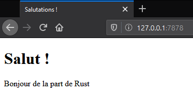

<!--
# Final Project: Building a Multithreaded Web Server
-->

# Projet final : construire un serveur web multitâches

<!--
It’s been a long journey, but we’ve reached the end of the book. In this
chapter, we’ll build one more project together to demonstrate some of the
concepts we covered in the final chapters, as well as recap some earlier
lessons.
-->

Ce fut un long voyage, mais nous avons atteint la fin de ce livre. Dans ce
chapitre, nous allons construire un nouveau projet ensemble pour mettre en
application certains concepts que nous avons vus dans les derniers chapitres, et
aussi pour récapituler quelques leçons précédentes.

<!--
For our final project, we’ll make a web server that says “hello” and looks like
Figure 20-1 in a web browser.
-->

Pour notre projet final, nous allons construire un serveur web qui dit
“salutations” et qui ressemble dans un navigateur web à l'illustration 20-1.

<!--

-->

<!--
Figure 20-1: Our final shared project
-->

Illustration 20-1 : notre dernier projet en commun

<!--
Here is the plan to build the web server:
-->

Voici le plan de construction du serveur web :

<!--
1. Learn a bit about TCP and HTTP.
2. Listen for TCP connections on a socket.
3. Parse a small number of HTTP requests.
4. Create a proper HTTP response.
5. Improve the throughput of our server with a thread pool.
-->

1. En savoir plus sur TCP et HTTP.
2. Ecouter les connections TCP sur un port.
3. Interpréter une petite quantité de requêtes HTTP.
4. Créer une réponse HTTP adéquate.
5. Augmenter le débit de notre serveur avec un groupe de tâches.

<!--
But before we get started, we should mention one detail: the method we’ll use
won’t be the best way to build a web server with Rust. A number of
production-ready crates are available on [crates.io](https://crates.io/) that
provide more complete web server and thread pool implementations than we’ll
build.
-->

Mais avant de commencer, nous devons signaler une chose : les méthodes que nous
allons utiliser ne sont pas les meilleures pour construire un serveur web avec
Rust. Un certain nombre de crates éprouvées en production et disponibles sur
[crates.io](https://crates.io/) fourniront des serveurs web et des
implémentations de groupe de tâches plus complets que ce que nous allons
construire.

<!--
However, our intention in this chapter is to help you learn, not to take the
easy route. Because Rust is a systems programming language, we can choose the
level of abstraction we want to work with and can go to a lower level than is
possible or practical in other languages. We’ll write the basic HTTP server and
thread pool manually so you can learn the general ideas and techniques behind
the crates you might use in the future.
-->

Toutefois, notre intention dans ce chapitre est de vous aider à apprendre, et
ne pas de se laisser aller à la facilité. Comme Rust est un langage de
programmation système, nous pouvons choisir le niveau d'abstraction avec 
lequel nous souhaitons travailler et nous pouvons descendre à un niveau plus bas
que ce qui est possible ou pratique dans d'autres langages. Nous allons écrire
manuellement le serveur HTTP basique et le groupe de tâches afin que vous
puissiez apprendre les idées et techniques générales qui se cachent derrière les crates que
vous serez peut-être amenés à utiliser à l'avenir.
